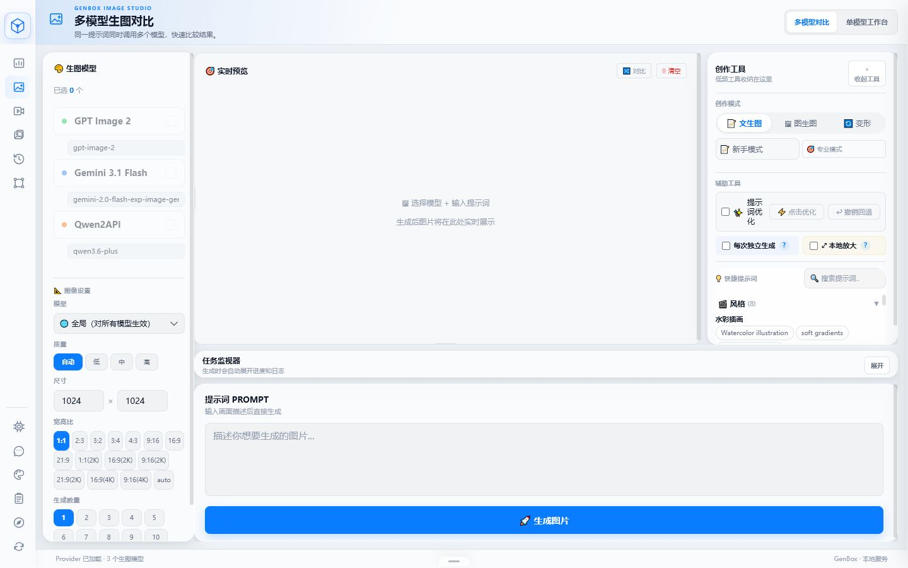
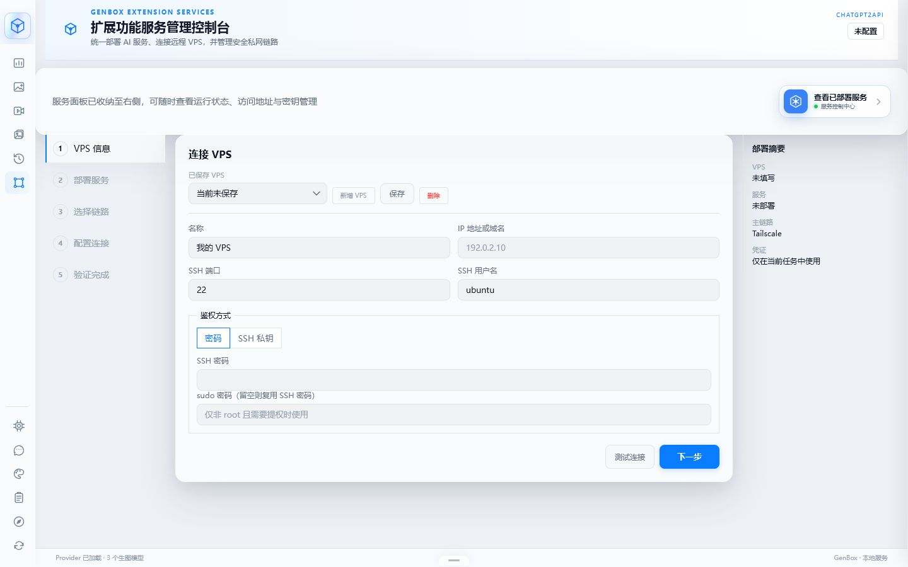
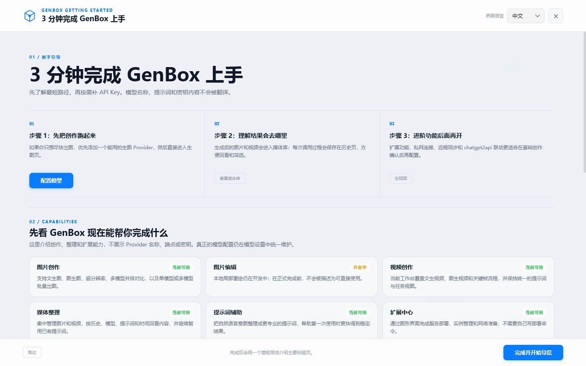

# GenBox - 多模型 AI 创作与媒体工作台

[](https://github.com/liwei9745/GenBox/actions/workflows/build.yml)
[](https://github.com/liwei9745/GenBox/releases/latest)
[](https://github.com/liwei9745/GenBox/stargazers)
[](https://github.com/liwei9745/GenBox/pkgs/container/genbox)
[](LICENSE)
[](https://deepwiki.com/liwei9745/GenBox)

**把同一个创意交给多个模型，同时生成、并排比较，再把图片、视频和提示词留在自己的媒体库里。**

[English](README_EN.md) · [下载最新版](https://github.com/liwei9745/GenBox/releases/latest) · [3 分钟快速开始](#快速开始) · [完整文档](docs/README.md) · [问题反馈](https://github.com/liwei9745/GenBox/issues)

## 为什么有 GenBox

作者最初想解决一个很具体的问题：**同一段提示词交给不同模型，效果到底有什么差别？** 市面上的工具大多围绕单个模型或单次生成设计，想做横向比较时，需要反复切换页面、复制参数，再手工整理结果。

于是有了 GenBox。它从“多模型同时生图和效果对比”开始，逐步加入视频生成、提示词辅助、媒体库、历史记录、主题与双语界面，以及面向自托管用户的扩展中心。目标一直没有变：让喜欢 AI 图像、视频创作和模型折腾的人保留选择与控制，也让第一次接触 API 的用户能顺利跑起来。

GenBox 适合多媒体生成爱好者、模型评测玩家、自托管极客，以及想用一个界面管理 OpenAI 兼容服务、Gemini、Qwen、Agnes 等模型入口的用户。

> [!IMPORTANT]
> **v2.5.0 是一次重大体验更新。** 新增扩展中心、双语界面、四段式新手引导、统一工作台、加密凭证库和经过实际启动验证的发布流程。[查看本次更新](release-notes-v2.5.0-zh.md)

## 主要界面截图

| 多模型同时生图与效果对比 | 扩展中心与远程服务管理 |
|---|---|
|  |  |
| **系统看板与运行状态** | **3 分钟新手引导** |
|  |  |

> 截图来自隔离的空数据客户端。主机名、IP、容量和运行统计均为明确标注的演示信息，不对应真实设备。

## 核心特色

- **多模型并排对比**：同一提示词一次交给多个模型，直接比较构图、风格和细节，也可以切换为专注的单模型工作台。
- **图片与视频创作**：支持文生图、图生图、变体、超分辨率、文生视频、图生视频和关键帧流程。
- **本地媒体库**：统一保存图片、视频、提示词、模型和历史记录，方便筛选、回看与再次使用。
- **提示词辅助**：把自然语言想法整理成更适合模型理解的描述，小白可以少记参数，进阶用户仍能保留完整控制。
- **扩展中心**：通过图形化步骤管理 VPS、独立服务实例、私网连接和远程图片导入，不需要在浏览器里手写部署命令。
- **本地优先与自托管**：可作为桌面客户端使用，也可以放在 NAS、VPS 或 Docker 中长期运行。

## 快速开始

### 我应该下载哪个文件？

| 你的设备 | 下载 | 运行方式 |
|---|---|---|
| Windows 10/11 | [GenBox-Windows.zip](https://github.com/liwei9745/GenBox/releases/latest/download/GenBox-Windows.zip) | 解压后双击 `GenBox.exe` |
| macOS | [GenBox-macOS.zip](https://github.com/liwei9745/GenBox/releases/latest/download/GenBox-macOS.zip) | 解压后运行 `GenBox-macOS` |
| Linux | [GenBox-Linux-x64.zip](https://github.com/liwei9745/GenBox/releases/latest/download/GenBox-Linux-x64.zip) | 解压、添加执行权限后运行 |
| NAS / VPS / Docker | [打开最新 Release](https://github.com/liwei9745/GenBox/releases/latest) | 下载名称包含 `Docker-Compose` 的压缩包 |

桌面客户端已经包含运行环境，**不需要另外安装 Python**。

### 3 分钟跑起来

1. 下载并解压对应平台的压缩包。
2. 启动 GenBox；浏览器没有自动打开时，访问 **[http://localhost:8891](http://localhost:8891)**。
3. 打开“模型设置”，添加一个可以生图的模型服务地址、模型名和 API Key。
4. 进入“图片生成”，选择模型，输入提示词并开始第一次生成。

> 不知道 Provider 是什么？可以把它理解为“模型服务入口”。GenBox 负责统一界面、参数、比较和媒体管理，实际生成由你配置的模型服务完成。

### 第一次使用请注意

- GenBox 本身不附带商业模型额度，需要你拥有相应服务的 API 地址和密钥。
- API Key 只应填在自己的 GenBox 中，不要发到 Issue、截图、聊天记录或公开日志。
- 默认桌面地址是 `http://localhost:8891`；只有源码开发环境默认使用 `8892`。
- v2.4.1 及更早的 Windows 客户端升级到 v2.5.0 时，需要手动下载 ZIP 完成一次升级，详见 [升级说明](release-notes-v2.5.0-zh.md#从旧版本升级)。
- chatgpt2api 属于第三方逆向研究项目，存在账号受限风险，不要使用重要账号测试。

<details>
<summary><strong>Docker / NAS / VPS 部署</strong></summary>

下载最新 Release 中名称包含 `Docker-Compose` 的压缩包，解压后运行：

```bash
cp .env.example .env
docker compose pull
docker compose up -d
```

默认访问 `http://localhost:8891`。运行数据保存在 `storage/`，升级前请备份该目录。远程访问必须配置管理员密钥，并把 `ALLOWED_ORIGINS` 设置为实际 HTTPS 或私网地址。

</details>

<details>
<summary><strong>从源码运行</strong></summary>

```bash
git clone https://github.com/liwei9745/GenBox.git
cd GenBox
python -m venv .venv

# Windows
.venv\Scripts\python -m pip install -r requirements.txt
.venv\Scripts\python main.py

# macOS / Linux
.venv/bin/python -m pip install -r requirements.txt
.venv/bin/python main.py
```

源码开发默认地址为 `http://localhost:8892`。完整环境变量和开发流程见 [更多文档说明](docs/README.md)。

</details>

## GenBox 与 chatgpt2api

可以把 chatgpt2api 理解为远程创作站，把 GenBox 理解为自己的创作控制台和作品仓库：前者提供兼容 API、账号与远程图片能力，后者负责多模型创作、媒体整理、历史回看、服务部署与连接管理。

当前 GenBox 可以引导部署独立实例、准备 Tailscale 私网并主动 Pull 图片。GenBox 的认证 Push 接收端基础也已经完成。

<details>
<summary><strong>哪些自动搬运能力还没有完成？</strong></summary>

chatgpt2api 发送端的生成后自动 Push、批量/定时增量搬运，以及收到匹配回执后再清理源图片，仍属于后续开发阶段。README 和界面不会把这些能力描述为已经可用。

</details>

## 查看更多文档说明

README 只保留普通用户最常用的信息。高级使用、部署、安全、集成和开发资料集中在 [docs/README.md](docs/README.md)：

| 我想了解 | 从这里开始 |
|---|---|
| 安装、升级与常见问题 | [v2.5.0 发布说明](release-notes-v2.5.0-zh.md) · [更新记录](CHANGELOG.md) |
| 产品方向和当前能力边界 | [产品定义](docs/PRODUCT.md) · [当前状态](docs/STATUS.md) |
| NAS、VPS、Docker 和安全发布 | [开发与发布生命周期](docs/DEVELOPMENT-LIFECYCLE.md) |
| GenBox 与 chatgpt2api 如何连接 | [集成协议](docs/INTEGRATION.md) |
| 架构、决策和后续阶段 | [架构](docs/ARCHITECTURE.md) · [决策记录](docs/DECISIONS.md) · [路线图](docs/ROADMAP.md) |

## 致谢

GenBox 的创作、网关适配、媒体处理和扩展中心参考了以下项目与服务。感谢作者和贡献者公开他们的工作：

| 项目 / 服务 | 作者 / 团队 | 与 GenBox 的关系 |
|---|---|---|
| [yukkcat/chatgpt2api](https://github.com/yukkcat/chatgpt2api) | [yukkcat](https://github.com/yukkcat) | 当前扩展中心部署、介绍和集成边界的上游参考 |
| [basketikun/chatgpt2api](https://github.com/basketikun/chatgpt2api) | [basketikun](https://github.com/basketikun) | GenBox 早期 GPT Image / chatgpt2api 能力的项目基础之一 |
| [4k-image-api](https://github.com/jianjianai/4k-image-api) | [简简aw](https://github.com/jianjianai) | 图片变形与 Lanczos 超分辨率思路 |
| [flow2api](https://github.com/TheSmallHanCat/flow2api) | [TheSmallHanCat](https://github.com/TheSmallHanCat) | Gemini 图片 / 视频接口适配参考 |
| [gemini2api](https://github.com/xwteam/gemini2api) | [xwteam](https://github.com/xwteam) | Gemini 兼容接口参考 |
| [AIClient2API](https://github.com/justlovemaki/AIClient2API) | [justlovemaki](https://github.com/justlovemaki) | 多协议 AI API 代理参考 |
| [Agnes AI](https://platform.agnes-ai.com) | [Sapiens AI](https://agnes-ai.com) | Agnes 图片与视频 API |

特别感谢 [@yukkcat](https://github.com/yukkcat) 在 [PR #4](https://github.com/liwei9745/GenBox/pull/4) 中提出 GHCR Docker Compose 发布包方案。

### 上游项目贡献者

感谢所有参与上游项目建设的贡献者，他们的公开工作为 GenBox 提供了重要参考。

<a href="https://github.com/basketikun/chatgpt2api/graphs/contributors">
  
</a>

## Star History

[](https://www.star-history.com/#liwei9745/GenBox&Date)

## 交流与授权

- 维护者：[@liwei9745](https://github.com/liwei9745)
- 问题与建议：[GitHub Issues](https://github.com/liwei9745/GenBox/issues)
- 交流群：[GenBox / ChatGPT2API QQ 交流群](https://qm.qq.com/q/yegwCqJisS)
- 授权：[GNU GPL v3.0 only](LICENSE)。发布的可执行文件、Docker 包和源码均可从
  GenBox 仓库获取；修改后再分发 GenBox 时，须同时提供对应源码并继续使用 GPLv3。
