# GenBox - 一站式 AI 创作平台

> 集成文生图、文生视频、图片超分、媒体库管理的桌面级 AI 创作工具
> 支持 GPT Image / Gemini / Qwen / Agnes 等主流模型，开箱即用

> 💡 觉得不错？点个 [Star](https://github.com/liwei9745/GenBox/stargazer) 鼓励一下吧！

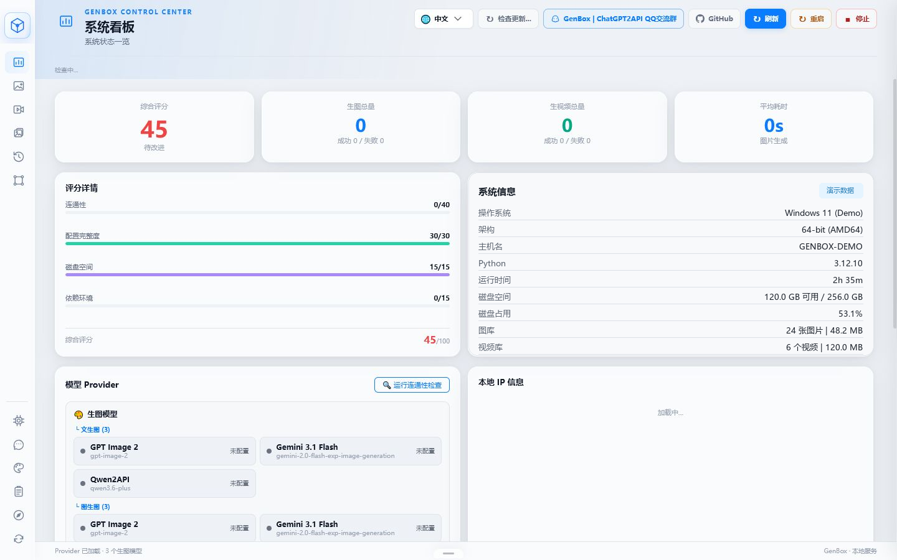

---

## 快速开始

### 🎯 下载客户端（推荐）

> ✅ **无需安装 Python、无需配置环境，下载即用**

前往 [Releases 页面](https://github.com/liwei9745/GenBox/releases/latest) 下载：

| 平台 | 文件 | 用途 | 运行方式 |
|------|------|------|----------|
| **Windows** | `GenBox.exe` | 本地使用 | 双击运行 |
| **macOS** | `GenBox-macOS` | 本地使用 | 终端运行 `chmod +x GenBox-macOS && ./GenBox-macOS` |
| **Linux** | `GenBox-Linux` | VPS 部署 | 终端运行 `chmod +x GenBox-Linux && ./GenBox-Linux` |

#### Windows 详细步骤

1. 点击上方链接，下载 `GenBox.exe`
2. 双击运行（首次可能需要在 Windows Defender 中点击"仍要运行"）
3. 浏览器自动打开 `http://localhost:8891`
4. 按照界面引导选择部署模式即可

#### macOS 注意事项

首次运行可能提示"无法验证开发者"：

1. 打开 **系统设置 → 隐私与安全性**
2. 在「安全性」部分点击 **仍要打开**

#### Linux (VPS) 注意事项

```bash
chmod +x GenBox-Linux
./GenBox-Linux
```

首次运行会引导你选择部署模式并自动生成管理员密钥。

---

### 📦 首次启动向导

无论使用哪个平台，首次启动都会显示配置向导：

```
请选择部署方式：
  [1] 本地使用    - 无需认证，打开即用（适合个人电脑）
  [2] VPS 部署    - 需要密钥认证，可远程访问（适合服务器）
  [3] Docker 部署 - 使用 .env.example 配置（适合生产环境）
```

- 选择 **1**（本地）：直接使用，无需任何配置
- 选择 **2**（VPS）：会自动生成管理密钥，并引导配置网络
- 选择 **3**（Docker）：显示 Docker 部署指引

---

### 💻 源码部署

<details>
<summary>点击展开源码部署步骤</summary>

#### 环境要求

| 依赖 | 说明 |
|------|------|
| Python 3.10+ | 必需 |
| pip | Python 包管理器 |
| ffmpeg | 视频生成必需（`sudo apt install ffmpeg` 或 `brew install ffmpeg`） |
| 现代浏览器 | Chrome / Firefox / Safari / Edge |

#### 安装步骤

**第一步：克隆项目**

```bash
git clone -b feat/quick-action-buttons https://github.com/liwei9745/GenBox.git
cd GenBox
```

**第二步：安装依赖**

```bash
pip install -r requirements.txt
```

**第三步：启动（首次运行会引导配置）**

```bash
python main.py
```

首次启动时会显示配置向导：

```
请选择部署方式：
  [1] 本地使用    - 无需认证，打开即用
  [2] VPS 部署    - 需要密钥认证，可远程访问
  [3] Docker 部署 - 使用 .env.example 配置
```

浏览器自动打开 `http://localhost:8891`

</details>

---

### 🐳 Docker 部署

<details>
<summary>点击展开 Docker 部署步骤</summary>

**步骤 1：配置环境**

```bash
git clone -b feat/quick-action-buttons https://github.com/liwei9745/GenBox.git
cd GenBox
cp .env.example .env
```

**步骤 2：编辑 `.env` 文件**

> ⚠️ **必填项**：`ALLOWED_ORIGINS` 必须设置为你的服务器 IP 或域名

```bash
# 最小配置示例（VPS 部署）
APP_MODE=prod
ALLOWED_ORIGINS=http://你的服务器IP:8891
GPT_IMAGE_API_KEY=sk-xxx
GPT_IMAGE_BASE_URL=https://api.openai.com/v1
```

**步骤 3：启动容器**

```bash
docker-compose up -d
```

**步骤 4：访问**

- 本机：`http://localhost:8891`
- VPS：`http://你的服务器IP:8891`

首次访问会显示管理密钥，请立即保存！

</details>

---

## 使用说明

1. 首次使用会自动生成管理员密钥
2. 在底部 Dock 栏点击「Provider 管理」添加你的 AI 模型
3. 选择模型 → 输入提示词 → 点击「生成图片」
4. 生成的图片在媒体库中管理

---

## 主要特性

### 多模型聚合
同时接入 OpenAI、Gemini、Qwen、Agnes 等 AI 模型，一个界面管理所有 Provider

### 并行生成 + 实时预览
多模型同时出图，结果实时分组展示，失败自动重试

### 图片超分放大
内置 Lanczos3 超分辨率算法，生成后一键放大到 4K 分辨率

### 视频生成
支持文生视频、图生视频、关键帧插值，多种时长可选

### 毛玻璃 UI
磨砂玻璃科幻风格，8 种主题一键切换

### 媒体库管理
本地图片/视频统一管理，支持批量下载、删除、重命名

---

## 页面展示

### 生图工作台

三栏布局：模型选择 | 实时预览 | 提示词输入

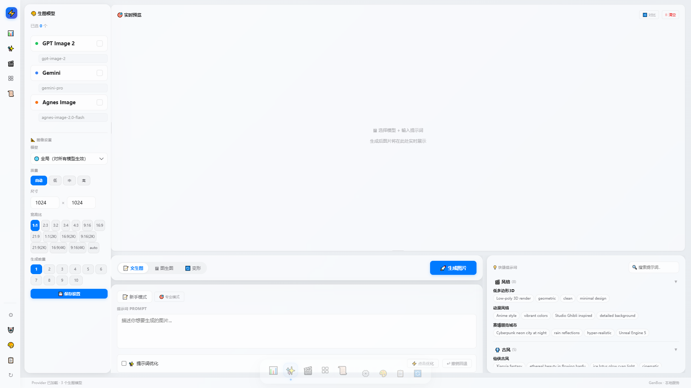

<details>
<summary>查看更多生图模式</summary>

| 图生图 | 变形 |
|--------|------|
| 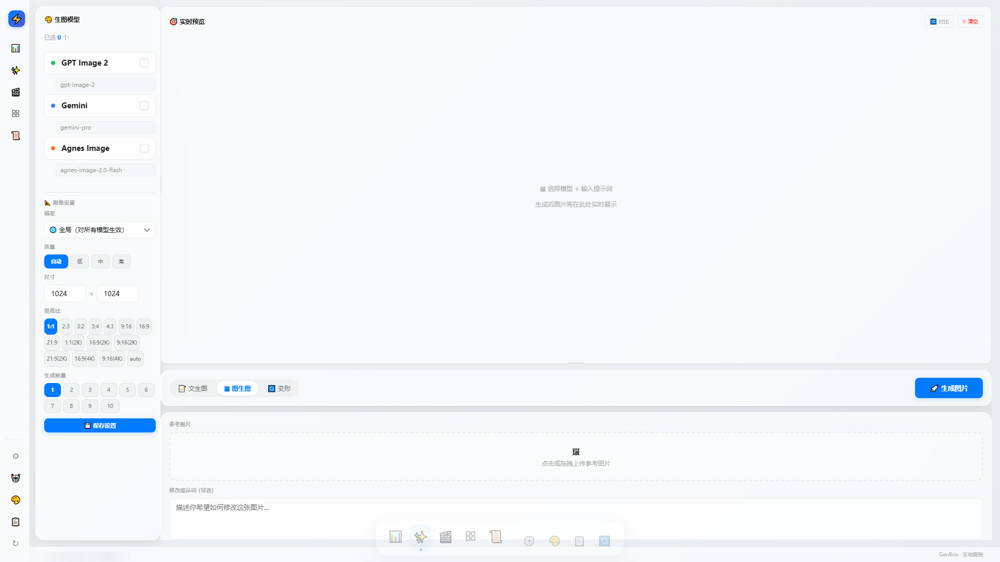 | 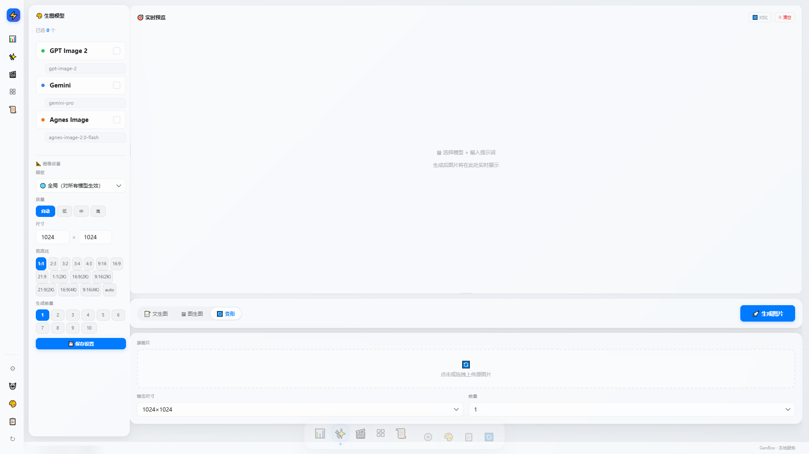 |

</details>

---

### 视频生成

支持文生视频、图生视频、关键帧模式

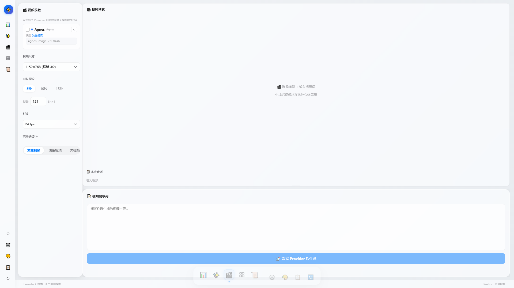

<details>
<summary>查看更多视频模式</summary>

| 图生视频 | 关键帧 | 高级选项 |
|----------|--------|----------|
| 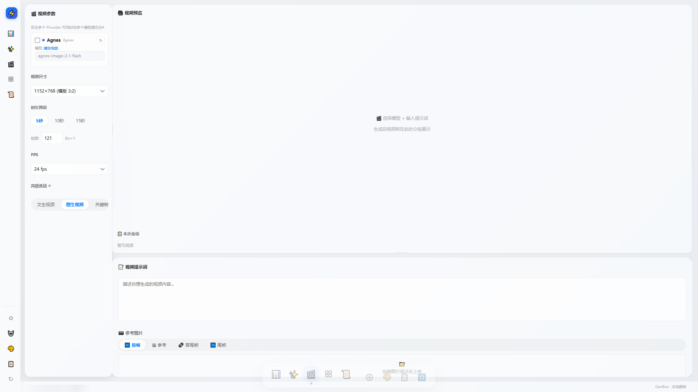 |  | 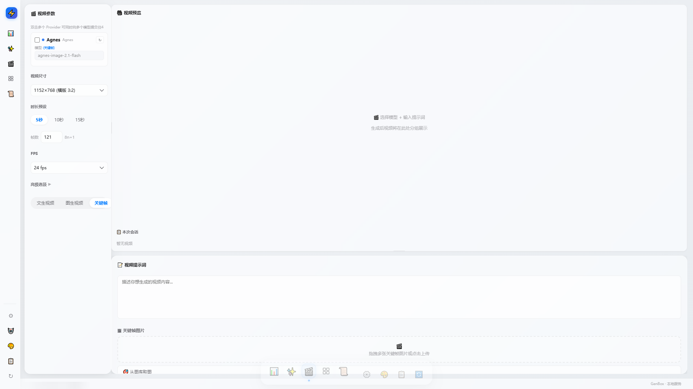 |

</details>

---

### 媒体库

本地生成的图片和视频统一管理

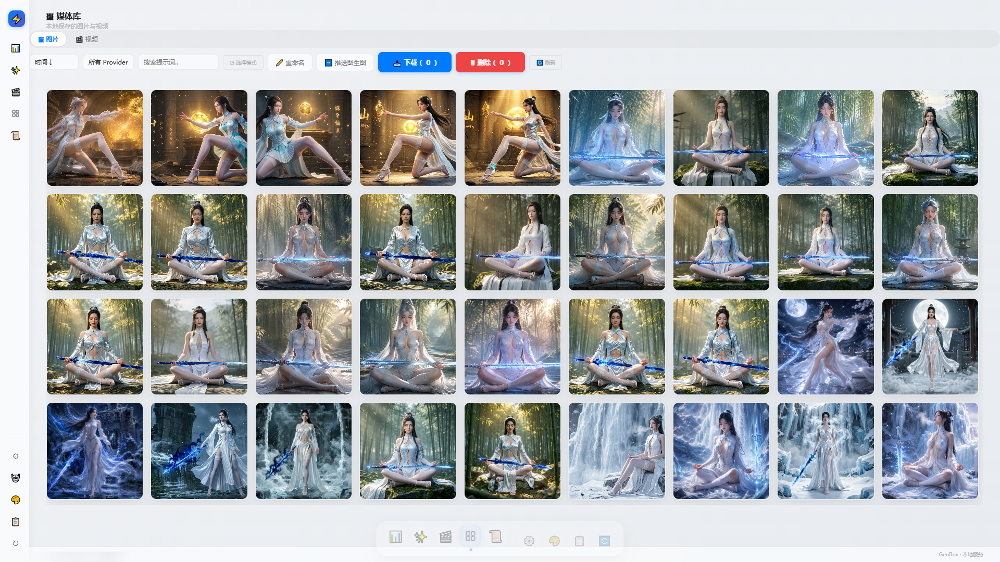

---

### 系统设置

| Provider 管理 | 主题切换 | 日志查看 |
|---------------|----------|----------|
| 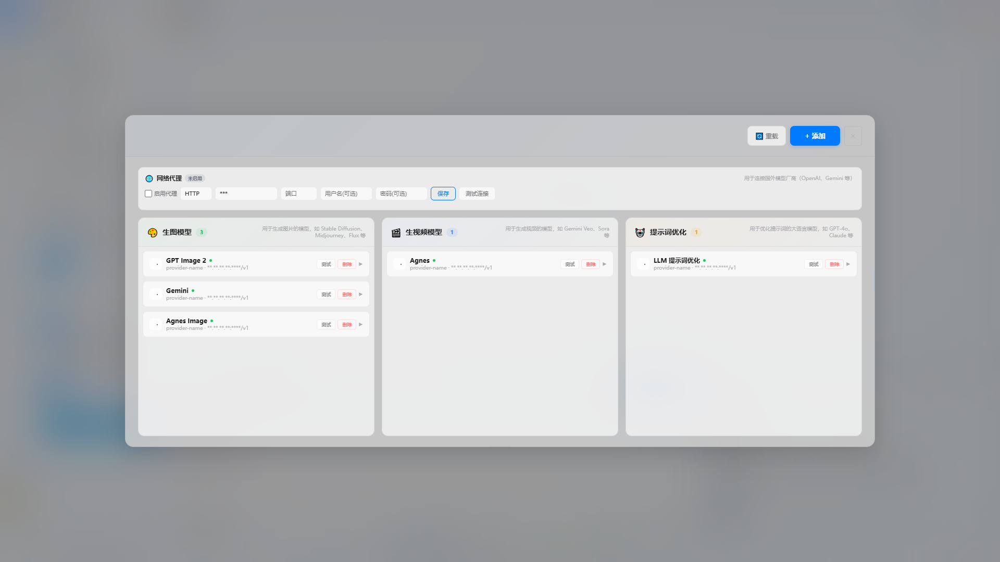 | 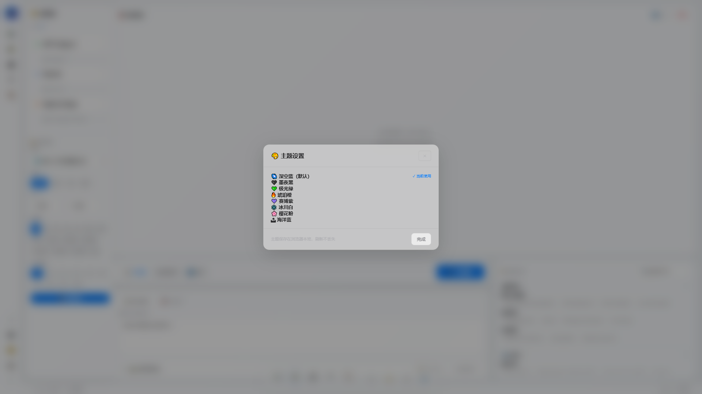 | 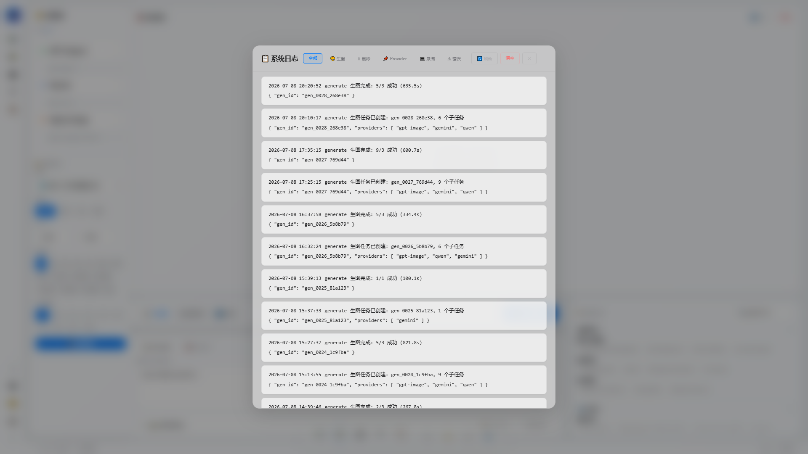 |

---

## 支持的模型协议

| 协议 | 支持的模型 |
|------|-----------|
| OpenAI 兼容 | GPT Image 2、DALL-E 3、Flux、SD-XL、SD-3 等 |
| Gemini | gemini-2.0-flash、gemini-3.1-flash 等 |
| Qwen | qwen3.6-Plus、qwen3.5-Plus、Wanx 系列 |
| Agnes | agnes-image-2.0-flash（图）、agnes-video（视频） |

---

## 配置说明

### API 地址配置

在 Web 界面的 Provider 管理中，你可以：

- 为每个模型配置多个端点（自动轮询容灾）
- 为每个端点配置多个 API Key（自动轮询防限流）
- 配置 HTTP/SOCKS5 代理

### 环境变量

| 变量名 | 说明 |
|--------|------|
| `GPT_IMAGE_API_KEY` | OpenAI / GPT Image API Key |
| `GPT_IMAGE_BASE_URL` | API 地址，默认 `https://api.openai.com/v1` |
| `GEMINI_API_KEY` | Google Gemini API Key |
| `QWEN_API_KEY` | 通义千问 API Key |
| `AGNES_API_KEY` | Agnes AI API Key |
| `LLM_API_KEY` | LLM 提示词优化（可选） |

---

## 技术栈

- 后端：Python + FastAPI
- 前端：原生 HTML/CSS/JS（毛玻璃 UI）
- AI 接口：OpenAI 兼容协议
- 图片处理：Pillow（Lanczos3 超分）

---

## 致谢

本项目的生图/生视频能力依赖以下优秀的开源项目，特此感谢：

| 项目 | 作者 | 贡献 |
|------|------|------|
| [chatgpt2api](https://github.com/basketikun/chatgpt2api) | [basketikun](https://github.com/basketikun) | GPT Image 生图接口支持 |
| [4k-image-api](https://github.com/jianjianai/4k-image-api) | [简简aw](https://github.com/jianjianai) | 图片变形 + Lanczos3 超分辨率 |
| [flow2api](https://github.com/TheSmallHanCat/flow2api) | [TheSmallHanCat](https://github.com/TheSmallHanCat) | Gemini 生图/生视频接口支持 |
| [gemini2api](https://github.com/xwteam/gemini2api) | [xwteam](https://github.com/xwteam) | Gemini Pro 生图接口支持 |
| [AIClient2API](https://github.com/justlovemaki/AIClient2API) | [justlovemaki](https://github.com/justlovemaki) | 多协议 AI API 代理 |
| [Agnes AI](https://platform.agnes-ai.com) | [Sapiens AI](https://agnes-ai.com) | Agnes 生图/生视频 API |

### 原版项目贡献者

感谢所有为上游项目做出贡献的开发者：

<a href="https://github.com/basketikun/chatgpt2api/graphs/contributors">
  
</a>

---

## Star History

<a href="https://www.star-history.com/?repos=liwei9745%2FGenBox&type=date&legend=top-left">
 <picture>
   <source media="(prefers-color-scheme: dark)" srcset="https://api.star-history.com/chart?repos=liwei9745/GenBox&type=date&theme=dark&legend=top-left&sealed_token=hbmjRTt8aa2MlVE9G0ff1S26Mg3GmI67QmAkoE-0Qz5hToR2-s0x810BeIFuXoiju0TCvYVRKBuvO9toojQR-vyxBsjsrjWI2IsR8mU32j9LyO4M00O0wQ" />
   <source media="(prefers-color-scheme: light)" srcset="https://api.star-history.com/chart?repos=liwei9745/GenBox&type=date&legend=top-left&sealed_token=hbmjRTt8aa2MlVE9G0ff1S26Mg3GmI67QmAkoE-0Qz5hToR2-s0x810BeIFuXoiju0TCvYVRKBuvO9toojQR-vyxBsjsrjWI2IsR8mU32j9LyO4M00O0wQ" />
   
 </picture>
</a>

---

## 交流群

QQ 群：1005859624（猴哥电话，非群主）

欢迎交流使用心得和反馈问题

---

## License

MIT
