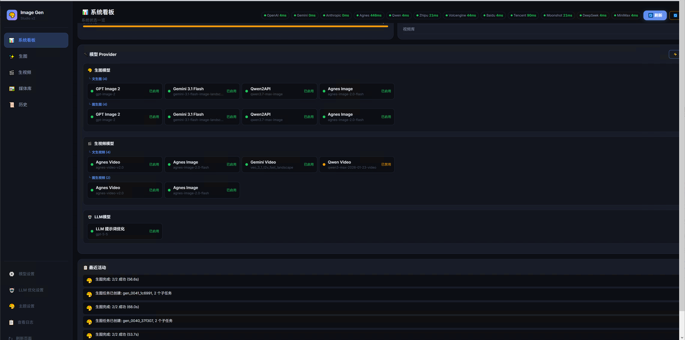
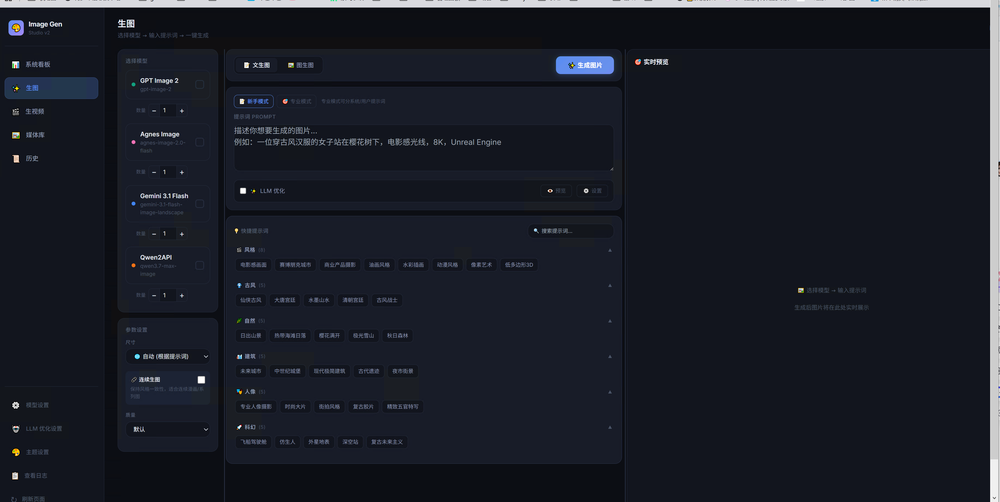
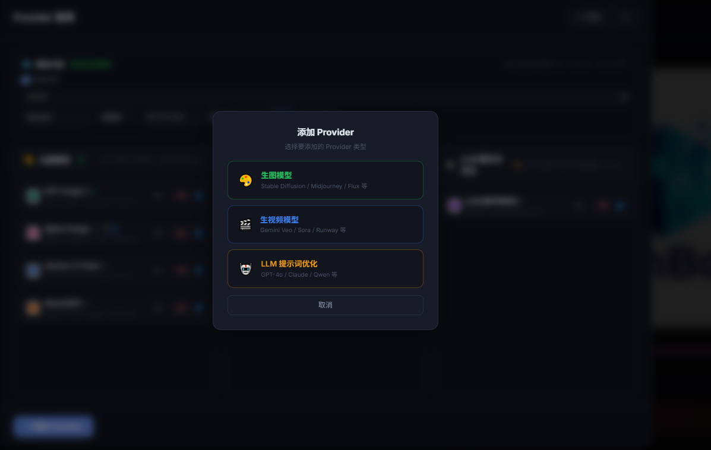
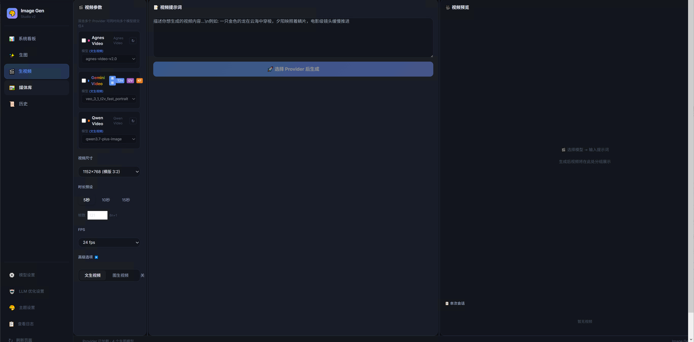

<div align="center">

# GenBox

**一站式 AI 创作工具箱 —— 多模型生图 · 生视频 · 提示词管理**

[](https://www.python.org/)
[](https://fastapi.tiangolo.com/)
[](LICENSE)
[]()
[](#中文文档)
[](#english-documentation)

<br>

**「不再为切换生图窗口烦恼，一个 GenBox 搞定所有 AI 创作」**

<br>

`AI多模态生成` `文生图` `图生图` `文生视频` `图生视频` `提示词管理` `多模型聚合` `AI创作工具`

<br>



</div>

---

## 🌿 分支说明 | Branches

| 分支 | 定位 | 端口 | 说明 |
|------|------|------|------|
| [`master`](https://github.com/liwei9745/GenBox) | 稳定版 | 8890 | 日常使用、生产环境 |
| [`feat/glass-ui-redesign`](https://github.com/liwei9745/GenBox/tree/feat/glass-ui-redesign) | 前瞻版 | 8891 | 毛玻璃 UI + 16路并发 + IP体检 |

📖 **详细对比请查看 [分支指南](docs/branches-guide.md)**

---

## 📖 项目简介 | About

GenBox 是一个本地部署的 **一站式 AI 创作工具箱**，将多个 AI 生图/生视频模型聚合在一个界面中，解决以下核心痛点：

| 痛点 | GenBox 的解决方案 |
|------|-------------------|
| 🔀 多模型切换麻烦 | 所有模型在一个界面管理，一键切换 |
| 📝 好用的提示词难复用 | 内置提示词管理系统，支持收藏和分组 |
| 🗣️ 自然语言不标准 | LLM 智能优化提示词，自动补充细节 |
| 🎬 图片视频分开管理 | 统一媒体库，图片视频一目了然 |
| ⚙️ 配置分散难维护 | 集中式 Provider 管理面板 |

### 支持的模型

| 类型 | 模型 | 来源 |
|------|------|------|
| 🎨 生图 | GPT Image 2 | [chatgpt2api](https://github.com/yukkcat/chatgpt2api) |
| 🎨 生图 | Gemini 3.1 Flash | [flow2api](https://github.com/TheSmallHanCat/flow2api) |
| 🎨 生图 | Gemini Pro | [gemini2api](https://github.com/xwteam/gemini2api) |
| 🎨 生图 | Agnes Image | [Agnes AI](https://platform.agnes-ai.com) |
| 🎨 生图 | Qwen2API ⚠️ | [qwen2API](https://github.com/YuJunZhiXue/qwen2API) *(暂不可用，等待作者更新)* |
| 🎬 生视频 | Agnes Video | [Agnes AI](https://platform.agnes-ai.com) |
| 🎬 生视频 | Gemini Video | [flow2api](https://github.com/TheSmallHanCat/flow2api) |
| 🎬 生视频 | Qwen Video ⚠️ | [qwen2API](https://github.com/YuJunZhiXue/qwen2API) *(暂不可用，等待作者更新)* |
| 🤖 LLM | 提示词优化 | 任意 OpenAI 兼容接口 |

---

## 🖼️ 界面预览 | Screenshots

<div align="center">

| 系统看板 | 生图界面 | 媒体库 |
|:-------:|:-------:|:-----:|
|  |  |  |

| Provider 管理 | Provider 设置 | 视频卡片 |
|:------------:|:------------:|:-------:|
|  |  |  |

| 历史记录 | 媒体库(视频) |
|:-------:|:----------:|
|  |  |

</div>

---

## 🏗️ 项目结构 | Project Structure

```
GenBox/
├── main.py                  # FastAPI 后端主程序
├── config.py                # 配置管理（Provider、代理、密钥）
├── requirements.txt         # Python 依赖
├── .env.example             # 环境变量模板
├── start.bat                # Windows 启动脚本
├── restart.bat              # Windows 重启脚本
├── stop.bat                 # Windows 停止脚本
├── launch_silent.vbs        # 静默启动（无命令行窗口）
├── create_shortcut.vbs      # 创建桌面快捷方式
├── static/
│   └── index.html           # 前端单页应用（6000+ 行）
├── providers/
│   ├── __init__.py          # 模型调度引擎（多 Provider 轮换）
│   ├── config.py            # Provider 配置加载
│   └── key_pool.py          # 多账户密钥池（轮换 + 冷却）
└── storage/                 # 运行时数据（自动创建）
    ├── gallery/             # 生成的图片
    ├── videos/              # 生成的视频
    ├── video_thumbs/        # 视频缩略图缓存
    └── memory/              # 提示词记忆
```

---

## ✨ 功能特性 | Features

### 🎨 生图引擎
- **异步生成** — 提交即返回，后台处理，实时进度追踪
- **增量预览** — 每张图生成完毕立即显示，无需等待全部完成
- **文生图 / 图生图** — 支持 T2I 和 I2I 两种模式
- **多模型并发** — 最多同时调用 2 个 Provider，加速生成
- **提示词优化** — LLM 智能优化，自然语言 → 专业提示词

### 🎬 生视频引擎
- **海报墙预览** — 视频卡片自动生成缩略图
- **悬停预览** — 鼠标悬停自动播放预览
- **多模型支持** — Agnes、Gemini、Qwen 等视频模型

### 🔧 Provider 管理
- **三级分类** — 🎨生图 / 🎬生视频 / 🤖LLM，水平三列布局
- **多账户轮换** — 支持同一模型配置多个 API Key，自动轮换
- **代理设置** — 支持 HTTP/SOCKS5 代理，自动检测系统代理
- **一键测试** — 连通性检测 + 模型列表拉取

### 📊 系统看板
- **综合评分** — 连通性 + 配置完整度 + 磁盘空间 + 依赖版本 = 100 分
- **网络监控** — 实时检测 12 家模型厂商连通性
- **一键重启** — 服务状态监控 + 远程重启/停止

### 🛡️ 安全策略
- **ADMINKEY 认证** — 首次启动自动生成管理密钥
- **开发模式** — 本地开发免认证，零配置开箱即用
- **密钥隔离** — API Key 仅存 `.env`，不进代码库

---

## 🚀 快速部署 | Quick Start

### 环境要求
- **Python 3.10+**（推荐 3.12）
- **Windows / Linux / macOS**
- **ffmpeg**（视频缩略图生成，可选）

### 方式一：直接运行

```bash
# 1. 解压项目到任意目录
unzip GenBox.zip -d /your/path/

# 2. 进入项目目录
cd GenBox

# 3. 安装依赖
pip install -r requirements.txt

# 4. 配置环境变量
cp .env.example .env
# 编辑 .env，填入你的 API Key

# 5. 启动
python main.py
# 或 Windows 用户双击 start.bat
```

### 方式二：Docker（开发中）

```bash
docker build -t genbox .
docker run -p 8890:8890 -v ./storage:/app/storage genbox
```

### 首次启动流程

1. 启动后浏览器自动打开 `http://localhost:8890`
2. 进入 **Provider 管理** 页面
3. 填入你已有的 API Key（至少配置一个即可开始使用）
4. 返回 **生图** 页面，输入提示词开始创作

### .env 配置示例

```env
# 安全策略（prod=启用认证，dev=免认证）
APP_MODE=dev

# 🎨 生图模型（按需配置，不需要的留空即可）
GPT_IMAGE_API_KEY=sk-your-key-here
GEMINI_API_KEY=your-gemini-key

# 🎬 生视频模型（可选）
AGNES_API_KEY=your-agnes-key

# 🤖 LLM 提示词优化（可选）
LLM_API_KEY=sk-your-llm-key
LLM_BASE_URL=https://api.openai.com/v1
```

---

## 🛠️ 技术栈 | Tech Stack

| 组件 | 技术 |
|------|------|
| 后端 | Python + FastAPI + Uvicorn |
| 前端 | 原生 HTML/CSS/JS（无框架依赖） |
| 数据存储 | JSON 文件 + PNG 元数据 |
| 视频处理 | ffmpeg（缩略图生成） |
| 认证 | ADMINKEY（基于密钥的简单认证） |

---

## 🙏 致谢 | Acknowledgements

本项目的生图/生视频能力依赖以下优秀的开源项目，特此感谢：

| 项目 | 作者 | 贡献 |
|------|------|------|
| [chatgpt2api](https://github.com/basketikun/chatgpt2api) | [basketikun](https://github.com/basketikun) | GPT Image 生图接口支持 |
| [4k-image-api](https://github.com/jianjianai/4k-image-api) | [简简aw](https://github.com/jianjianai) | 图片变形 + Lanczos3 超分辨率 |
| [flow2api](https://github.com/TheSmallHanCat/flow2api) | [TheSmallHanCat](https://github.com/TheSmallHanCat) | Gemini 生图/生视频接口支持 |
| [gemini2api](https://github.com/xwteam/gemini2api) | [xwteam](https://github.com/xwteam) | Gemini Pro 生图接口支持 |
| [AIClient2API](https://github.com/justlovemaki/AIClient2API) | [justlovemaki](https://github.com/justlovemaki) | 多协议 AI API 代理 |
| [Agnes AI](https://platform.agnes-ai.com) | [Sapiens AI](https://agnes-ai.com) | Agnes 生图/生视频 API |

### 原版项目贡献者

感谢所有为上游项目做出贡献的开发者：

<a href="https://github.com/basketikun/chatgpt2api/graphs/contributors">
  
</a>


## Star History

<a href="https://www.star-history.com/?repos=liwei9745%2FGenBox&type=date&legend=top-left">
 <picture>
   <source media="(prefers-color-scheme: dark)" srcset="https://api.star-history.com/chart?repos=liwei9745/GenBox&type=date&theme=dark&legend=top-left&sealed_token=hbmjRTt8aa2MlVE9G0ff1S26Mg3GmI67QmAkoE-0Qz5hToR2-s0x810BeIFuXoiju0TCvYVRKBuvO9toojQR-vyxBsjsrjWI2IsR8mU32j9LyO4M00O0wQ" />
   <source media="(prefers-color-scheme: light)" srcset="https://api.star-history.com/chart?repos=liwei9745/GenBox&type=date&legend=top-left&sealed_token=hbmjRTt8aa2MlVE9G0ff1S26Mg3GmI67QmAkoE-0Qz5hToR2-s0x810BeIFuXoiju0TCvYVRKBuvO9toojQR-vyxBsjsrjWI2IsR8mU32j9LyO4M00O0wQ" />
   
 </picture>
</a>
---

## 📋 常见问题 | FAQ

### Q: 启动后页面空白？
A: 检查 Python 版本是否 ≥ 3.10，运行 `python --version` 确认。

### Q: 生图报错 422？
A: 检查 `.env` 中的 API Key 是否正确配置。

### Q: 视频缩略图不显示？
A: 需要安装 ffmpeg 并添加到系统 PATH。

### Q: 如何启用登录认证？
A: 在 `.env` 中设置 `APP_MODE=prod`，首次启动会自动生成 ADMINKEY。

---

## 📄 开源协议 | License

本项目基于 [MIT License](LICENSE) 开源。

---

<div align="center">

**如果 GenBox 对你有帮助，欢迎 Star ⭐ 支持！**

Made with ❤️ by the open-source community

</div>

---

<a id="chinese-docs"></a>

## 📖 中文文档

<details>
<summary><b>点击展开完整中文文档</b></summary>

### 什么是 GenBox？

GenBox（Generate Box）是一个本地部署的 AI 创作工具箱。它把多个 AI 生图和生视频模型整合在一个界面里，你不需要再为每个模型打开不同的网站或工具。

### 为什么做这个项目？

**痛点 1：切换窗口太麻烦**
> 想用 GPT 生图要去一个网站，想用 Gemini 又要去另一个，想用 Agnes 生视频还得再开一个窗口……

**痛点 2：好用的提示词记不住**
> 上次写了个很好的提示词，下次想用却找不到了。

**痛点 3：提示词写不标准**
> 用中文写的提示词效果不好，用英文又写不流利。

GenBox 就是为了解决这些问题而生的。

### 功能一览

- ✅ 多模型生图（GPT、Gemini、Qwen、Agnes）
- ✅ 多模型生视频（Agnes、Gemini、Qwen）
- ✅ 文生图 + 图生图
- ✅ 文生视频 + 图生视频
- ✅ LLM 智能优化提示词
- ✅ 提示词管理（收藏、分组）
- ✅ 统一媒体库（图片 + 视频）
- ✅ 视频海报墙 + 悬停预览
- ✅ 多账户密钥轮换
- ✅ 系统看板 + 网络监控

### 部署步骤（小白版）

**第一步：安装 Python**
1. 打开 https://www.python.org/downloads/
2. 下载 Python 3.12 或更高版本
3. 安装时勾选 "Add Python to PATH"

**第二步：下载 GenBox**
1. 下载 GenBox 压缩包
2. 解压到你喜欢的目录（如 `D:\GenBox`）

**第三步：安装依赖**
1. 打开命令行（Win+R 输入 cmd）
2. 输入：`pip install -r requirements.txt`
3. 等待安装完成

**第四步：配置 API Key**
1. 复制 `.env.example` 为 `.env`
2. 用记事本打开 `.env`
3. 填入你的 API Key（至少填一个就能用）

**第五步：启动**
1. 双击 `start.bat`
2. 浏览器会自动打开 http://localhost:8890
3. 开始创作！

</details>

---

<a id="english-docs"></a>

## 🇺🇸 English Documentation

<details>
<summary><b>Click to expand full English documentation</b></summary>

### What is GenBox?

GenBox (Generate Box) is a locally-deployed AI creative toolkit that aggregates multiple AI image and video generation models into a single interface. No more switching between different websites and tools for each model.

### Why GenBox?

| Problem | Solution |
|---------|----------|
| Switching between multiple AI tools is tedious | All models in one unified interface |
| Good prompts are hard to reuse | Built-in prompt management system |
| Prompts written in natural language lack quality | LLM-powered prompt optimization |

### Features

- Multi-model image generation (GPT, Gemini, Qwen, Agnes)
- Multi-model video generation (Agnes, Gemini, Qwen)
- Text-to-Image & Image-to-Image
- Text-to-Video & Image-to-Video
- LLM prompt optimization
- Prompt management (favorites, groups)
- Unified media library (images + videos)
- Video poster wall with hover preview
- Multi-account API key rotation
- System dashboard with network monitoring

### Quick Start

```bash
# 1. Extract GenBox
# 2. Install dependencies
pip install -r requirements.txt

# 3. Configure API keys
cp .env.example .env
# Edit .env with your API keys

# 4. Start
python main.py
# Or double-click start.bat on Windows
```

Open `http://localhost:8890` in your browser and start creating!

</details>

---

## 🔍 标签 | Tags

<!-- GitHub 搜索关键词 -->
`GenBox` `AI生图` `AI生视频` `多模型聚合` `提示词管理` `AI创作工具` `文生图` `图生图` `文生视频` `图生视频` `GPT Image` `Gemini` `Qwen` `Agnes` `AI Image Generator` `AI Video Generator` `Prompt Management` `Multi-Model AI` `Local AI Toolkit` `FastAPI` `Python`
