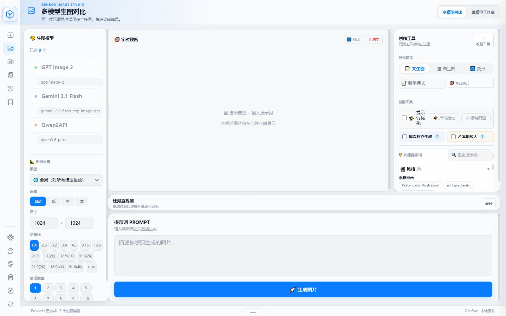
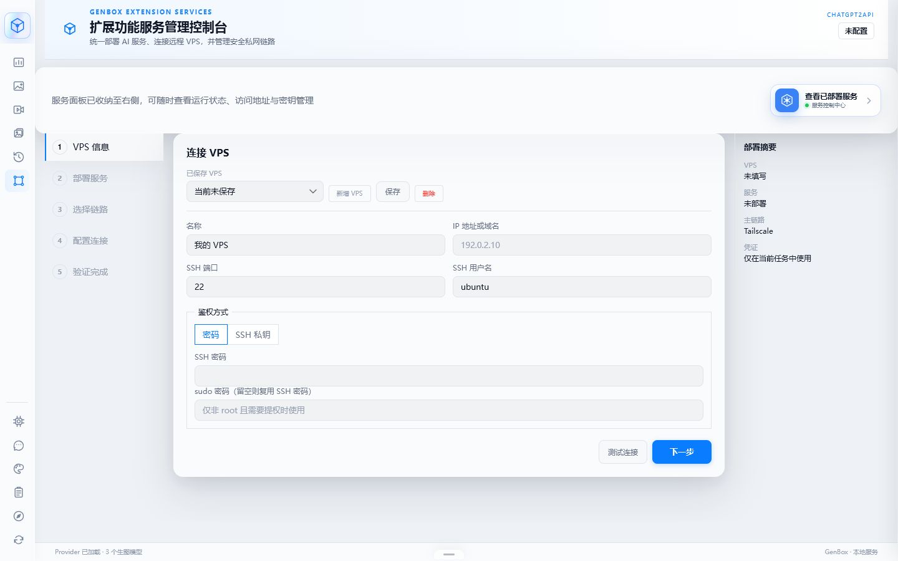
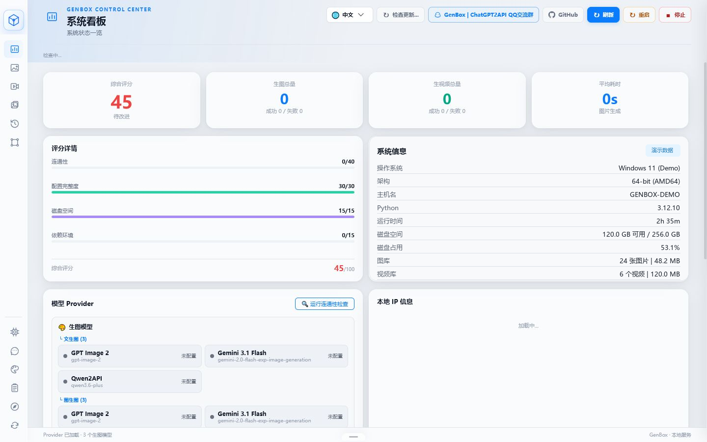
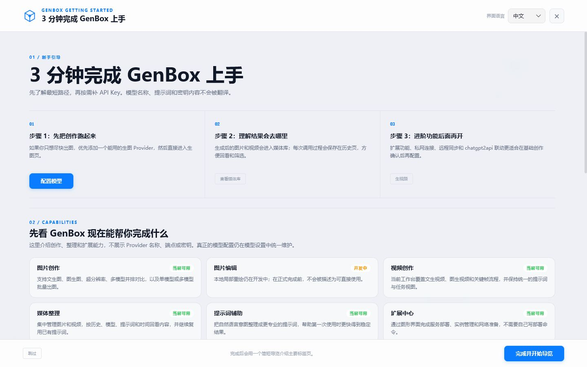

# GenBox - 多模型 AI 创作与媒体工作台

[](https://github.com/liwei9745/GenBox/actions/workflows/build.yml)
[](https://github.com/liwei9745/GenBox/releases/latest)
[](https://github.com/liwei9745/GenBox/stargazers)
[](https://github.com/liwei9745/GenBox/pkgs/container/genbox)
[](LICENSE)
[](https://deepwiki.com/liwei9745/GenBox)

**把同一个创意交给多个模型并排比较，再用批注、扩图、抠图和版本对比继续精修，最后把图片、视频与提示词留在自己的媒体库里。**

[English](README_EN.md) · [下载最新版](https://github.com/liwei9745/GenBox/releases/latest) · [3 分钟快速开始](#快速开始) · [文档地图](docs/DOCUMENTATION-MAP.md) · [问题反馈](https://github.com/liwei9745/GenBox/issues)

## 为什么有 GenBox

作者最初想解决一个很具体的问题：**同一段提示词交给不同模型，效果到底有什么差别？** 市面上的工具大多围绕单个模型或单次生成设计，想做横向比较时，需要反复切换页面、复制参数，再手工整理结果。

于是有了 GenBox。它从“多模型同时生图和效果对比”开始，逐步加入精准改图、视频生成、提示词辅助、媒体库、历史记录、主题与双语界面，以及面向自托管用户的扩展中心。目标一直没有变：让喜欢 AI 图像、视频创作和模型折腾的人保留选择与控制，也让第一次接触 API 的用户能顺利跑起来。

GenBox 适合多媒体生成爱好者、模型评测玩家、自托管极客，以及想用一个界面管理 OpenAI 兼容服务、Gemini、Qwen、Agnes 等模型入口的用户。

> [!IMPORTANT]
> **v2.6.6 是“精准改图 V4 + 发布链路修复”的当前稳定版本。** 精准改图工作台提供可编辑批注、二次调整、尺寸扩图、修改前/修改后/滑杆对比、透明结果预览，以及本地抠图与细化框架。Provider 能力和支持尺寸必须明确声明或由用户确认；别名只会通过显式配置或用户确认的受限兼容映射继承能力，缺失或歧义时会安全拒绝。Windows、macOS、Linux、Docker Compose、GHCR 镜像和源码发布包已经通过对应的发布验证。[查看本次更新](release-notes-v2.6.6-zh.md)

> [!NOTE]
> 精准改图的远程生成仍由你配置的 Provider 完成，本次发布验证没有执行真实 Provider 请求。发布包包含 NumPy、ONNX Runtime 和本地抠图适配器，但**不包含 ONNX 抠图 checkpoint**；生产联网下载/安装保持禁用，因为其来源、训练数据沿革和商业使用权仍为 **UNVERIFIED（未验证）**。操作者手动放置的模型也必须通过固定大小、哈希和可执行性检查后才能启用。

## 主要界面截图

| 精准改图 V4：批注、扩图与版本对比 | 多模型同时生图与效果对比 |
|---|---|
|  |  |
| **扩展中心与远程服务管理** | **系统看板与运行状态** |
|  |  |

<details>
<summary><strong>查看 3 分钟新手引导界面</strong></summary>



</details>

> 截图来自隔离的空数据客户端。主机名、IP、容量和运行统计均为明确标注的演示信息，不对应真实设备。

## 核心特色

- **精准改图 V4**：可从本地文件、媒体库或生成结果进入工作台，用选择/移动、箭头、矩形、椭圆、画笔、橡皮和文字标出修改意图；支持撤销/重做、对象移动与缩放，并可把选定版本设为下一次编辑底图。
- **尺寸扩图与版本对比**：在 Provider 明确支持的尺寸内进行纯尺寸扩展；默认严格校验返回像素，也可显式选择受限的 `fit_crop`。结果保留为版本，可查看修改前、修改后或拖动分隔线对比，透明区域使用棋盘格显示。
- **本地抠图框架**：提供透明抠图、选区细化、羽化和前景恢复工作流；运行时适配器已经打包，但 ONNX checkpoint 需要操作者另行提供并通过完整性与可执行性检查。
- **Provider 能力门槛**：精准改图能力和支持尺寸必须由端点声明或用户确认；别名关系仅来自显式配置或用户确认的受限兼容映射，不会因为目录里出现相似模型名就自动放行。Provider 返回图片还会经过 MIME、压缩字节、解码像素和解压炸弹检查。
- **多模型并排对比**：同一提示词一次交给多个模型，直接比较构图、风格和细节，也可以切换为专注的单模型工作台。
- **图片与视频创作**：支持文生图、图生图、变体、超分辨率、文生视频、图生视频和关键帧流程。
- **本地媒体库**：统一保存图片、视频、提示词、模型和历史记录，方便筛选、回看与再次使用。
- **提示词辅助**：把自然语言想法整理成更适合模型理解的描述，小白可以少记参数，进阶用户仍能保留完整控制。
- **扩展中心**：通过图形化步骤管理 VPS、独立服务实例、私网连接和远程图片导入，不需要在浏览器里手写部署命令。
- **完整发布矩阵**：可直接下载 Windows、macOS 和 Linux 客户端，也提供 Docker Compose、GHCR 镜像与源码包；桌面客户端内置 Python 运行环境。
- **本地优先与自托管**：可作为桌面客户端使用，也可以放在 NAS、VPS 或 Docker 中长期运行。

## 快速开始

### 我应该下载哪个文件？

| 你的设备 | 下载 | 运行方式 |
|---|---|---|
| Windows 10/11 | [GenBox-Windows.zip](https://github.com/liwei9745/GenBox/releases/latest/download/GenBox-Windows.zip) | 解压后双击 `GenBox.exe` |
| macOS | [GenBox-macOS.zip](https://github.com/liwei9745/GenBox/releases/latest/download/GenBox-macOS.zip) | 解压后运行 `GenBox-macOS` |
| Linux | [GenBox-Linux-x64.zip](https://github.com/liwei9745/GenBox/releases/latest/download/GenBox-Linux-x64.zip) | 解压、添加执行权限后运行 |
| NAS / VPS / Docker | [打开最新 Release](https://github.com/liwei9745/GenBox/releases/latest) | 下载名称包含 `Docker-Compose` 的压缩包 |

桌面客户端已经包含运行环境，**不需要另外安装 Python**。

### 3 分钟跑起来

1. 下载并解压对应平台的压缩包。
2. 启动 GenBox；浏览器没有自动打开时，访问 **[http://localhost:8891](http://localhost:8891)**。
3. 打开“模型设置”，添加一个可以生图的模型服务地址、模型名和 API Key。
4. 进入“图片生成”，选择模型，输入提示词并开始第一次生成。

> 不知道 Provider 是什么？可以把它理解为“模型服务入口”。GenBox 负责统一界面、参数、比较和媒体管理，实际生成由你配置的模型服务完成。精准改图还要求端点明确声明（或由你确认）模型的编辑能力和支持尺寸；自定义别名只有在你明确确认兼容映射后才会继承已验证合约。

### 第一次使用请注意

- GenBox 本身不附带商业模型额度，需要你拥有相应服务的 API 地址和密钥。
- API Key 只应填在自己的 GenBox 中，不要发到 Issue、截图、聊天记录或公开日志。
- 默认桌面地址是 `http://localhost:8891`；只有源码开发环境默认使用 `8892`。
- ONNX 抠图 checkpoint 不随 v2.6.6 发布包提供，生产联网安装也处于禁用状态；没有经过验证的本地模型时，抠图按钮会安全保持不可用。
- v2.4.1 及更早的 Windows 客户端升级到 v2.5.1 时，需要手动下载 ZIP 完成一次升级，详见 [升级说明](release-notes-v2.5.1-zh.md#安全升级)。
- chatgpt2api 属于第三方逆向研究项目，存在账号受限风险，不要使用重要账号测试。

<details>
<summary><strong>Docker / NAS / VPS 部署</strong></summary>

下载最新 Release 中名称包含 `Docker-Compose` 的压缩包，解压后运行：

```bash
cp .env.example .env
docker compose pull
docker compose up -d
```

默认访问 `http://localhost:8891`。运行数据保存在 `storage/`，升级前请备份该目录。远程访问必须配置管理员密钥，并把 `ALLOWED_ORIGINS` 设置为实际 HTTPS 或私网地址。

</details>

<details>
<summary><strong>从源码运行</strong></summary>

```bash
git clone https://github.com/liwei9745/GenBox.git
cd GenBox
python -m venv .venv

# Windows
.venv\Scripts\python -m pip install -r requirements.txt
.venv\Scripts\python main.py

# macOS / Linux
.venv/bin/python -m pip install -r requirements.txt
.venv/bin/python main.py
```

源码开发默认地址为 `http://localhost:8892`。完整环境变量和开发流程见 [文档地图](docs/DOCUMENTATION-MAP.md)。

</details>

## GenBox 与 chatgpt2api

可以把 chatgpt2api 理解为远程创作站，把 GenBox 理解为自己的创作控制台和作品仓库：前者提供兼容 API、账号与远程图片能力，后者负责多模型创作、媒体整理、历史回看、服务部署与连接管理。

当前 GenBox 可以引导部署独立实例、准备 Tailscale 私网、主动 Pull 图片，并接收经过认证且可幂等重试的图片 Push。配合兼容的 chatgpt2api 发送端，可以完成单张、手动批量和定时增量搬运；这不代表原始上游仓库的所有发行版都已经包含发送端改动。

<details>
<summary><strong>上游与源图清理边界</strong></summary>

发送端改动仍在独立分支和上游提案流程中；使用未经确认的原始 chatgpt2api 版本前，请先核对其是否实现 GenBox Push v1。源图删除默认关闭、开发环境禁用，并且只有在用户对本次操作明确选择删除、收到认证且 SHA-256 匹配的 `safe_to_delete_source=true` 回执、并再次确认源文件内容未变化时才允许执行。上游合并与真实环境行为不能从 GenBox v2.6.6 的发布成功中推断。

</details>

## 查看更多文档说明

README 只保留普通用户最常用的信息。高级使用、部署、安全、集成和开发资料可从 [文档地图](docs/DOCUMENTATION-MAP.md) 进入：

| 我想了解 | 从这里开始 |
|---|---|
| 安装、升级与常见问题 | [v2.6.6 发布说明](release-notes-v2.6.6-zh.md) · [更新记录](CHANGELOG.md) |
| 产品方向和当前能力边界 | [产品定义](docs/PRODUCT.md) · [当前状态](docs/STATUS.md) |
| NAS、VPS、Docker 和安全发布 | [开发与发布生命周期](docs/DEVELOPMENT-LIFECYCLE.md) |
| GenBox 与 chatgpt2api 如何连接 | [集成协议](docs/INTEGRATION.md) |
| 架构、决策和后续阶段 | [架构](docs/ARCHITECTURE.md) · [决策记录](docs/DECISIONS.md) · [路线图](docs/ROADMAP.md) |

## 致谢

GenBox 的创作、网关适配、媒体处理和扩展中心参考了以下项目与服务。感谢作者和贡献者公开他们的工作：

| 项目 / 服务 | 作者 / 团队 | 与 GenBox 的关系 |
|---|---|---|
| [yukkcat/chatgpt2api](https://github.com/yukkcat/chatgpt2api) | [yukkcat](https://github.com/yukkcat) | 当前扩展中心部署、介绍和集成边界的上游参考 |
| [basketikun/chatgpt2api](https://github.com/basketikun/chatgpt2api) | [basketikun](https://github.com/basketikun) | GenBox 早期 GPT Image / chatgpt2api 能力的项目基础之一 |
| [4k-image-api](https://github.com/jianjianai/4k-image-api) | [简简aw](https://github.com/jianjianai) | 图片变形与 Lanczos 超分辨率思路 |
| [flow2api](https://github.com/TheSmallHanCat/flow2api) | [TheSmallHanCat](https://github.com/TheSmallHanCat) | Gemini 图片 / 视频接口适配参考 |
| [gemini2api](https://github.com/xwteam/gemini2api) | [xwteam](https://github.com/xwteam) | Gemini 兼容接口参考 |
| [AIClient2API](https://github.com/justlovemaki/AIClient2API) | [justlovemaki](https://github.com/justlovemaki) | 多协议 AI API 代理参考 |
| [Agnes AI](https://platform.agnes-ai.com) | [Sapiens AI](https://agnes-ai.com) | Agnes 图片与视频 API |

特别感谢 [@yukkcat](https://github.com/yukkcat) 在 [PR #4](https://github.com/liwei9745/GenBox/pull/4) 中提出 GHCR Docker Compose 发布包方案。

### 上游项目贡献者

感谢所有参与上游项目建设的贡献者，他们的公开工作为 GenBox 提供了重要参考。

<a href="https://github.com/basketikun/chatgpt2api/graphs/contributors">
  
</a>

## Star History

[](https://www.star-history.com/#liwei9745/GenBox&Date)

## 交流与授权

- 维护者：[@liwei9745](https://github.com/liwei9745)
- 问题与建议：[GitHub Issues](https://github.com/liwei9745/GenBox/issues)
- 交流群：[GenBox / ChatGPT2API QQ 交流群](https://qm.qq.com/q/yegwCqJisS)
- 授权：[GNU GPL v3.0 only](LICENSE)。发布的可执行文件、Docker 包和源码均可从
  GenBox 仓库获取；修改后再分发 GenBox 时，须同时提供对应源码并继续使用 GPLv3。
