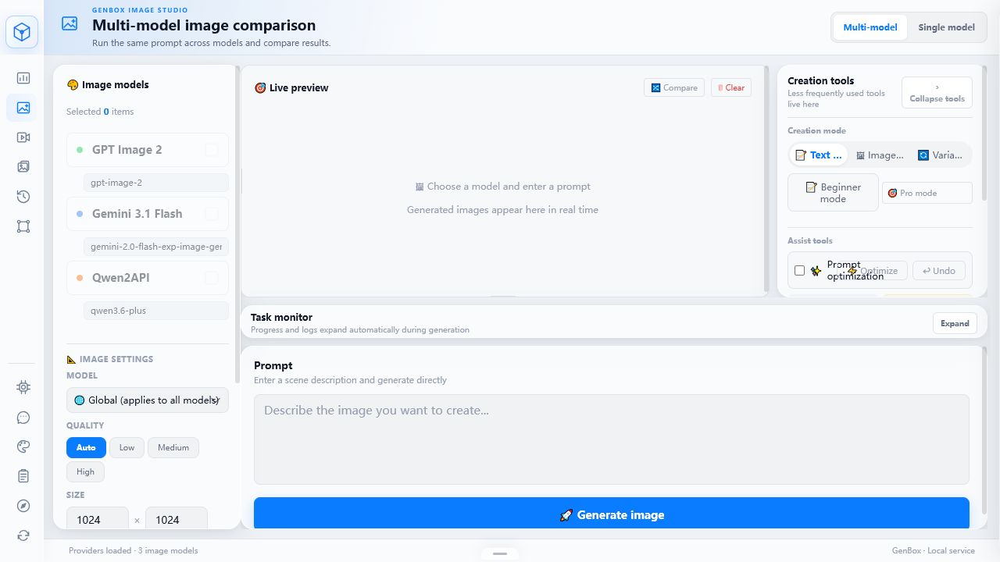
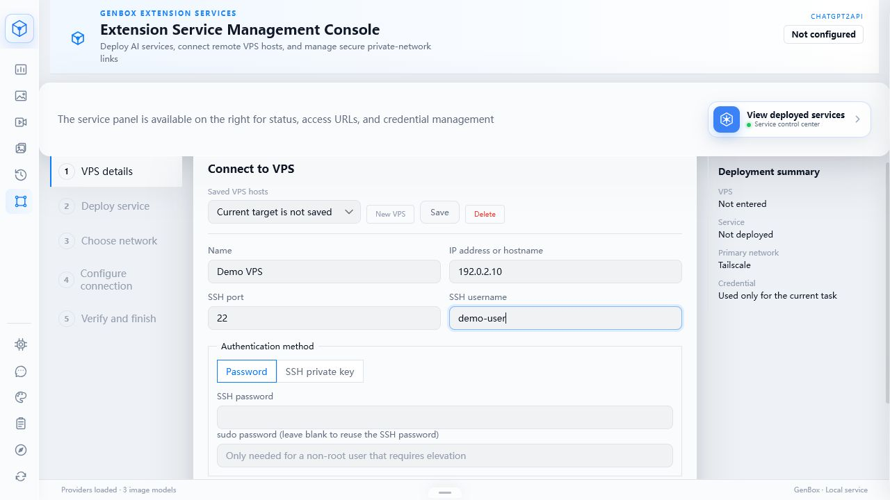
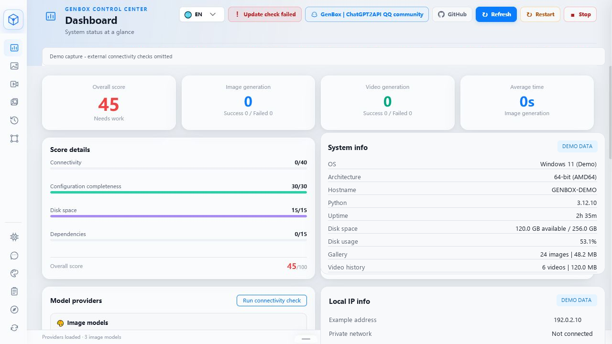
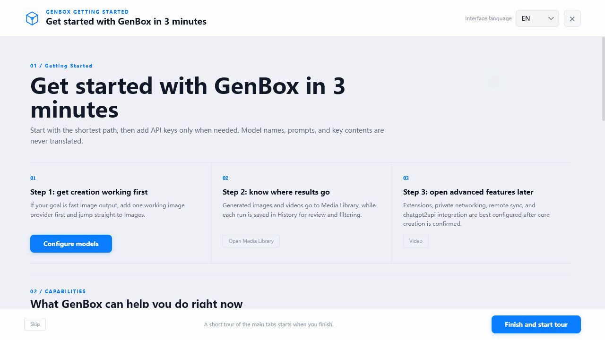
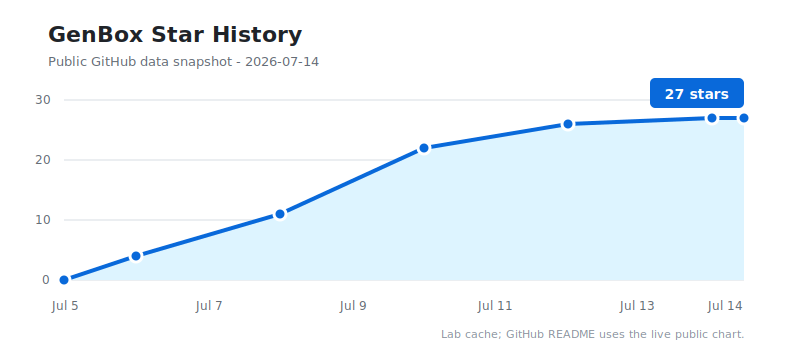

# GenBox - Multi-Model AI Creation and Media Workspace

[](https://github.com/liwei9745/GenBox/actions/workflows/build.yml)
[](https://github.com/liwei9745/GenBox/releases/latest)
[](https://github.com/liwei9745/GenBox/stargazers)
[](https://github.com/liwei9745/GenBox/pkgs/container/genbox)
[](LICENSE)
[](https://deepwiki.com/liwei9745/GenBox)

**Send one idea to several models, compare the results side by side, and keep your images, videos, prompts, and history in your own media workspace.**

[中文](README.md) · [Download](https://github.com/liwei9745/GenBox/releases/latest) · [3-minute start](#quick-start) · [Documentation](docs/README.md) · [Report an issue](https://github.com/liwei9745/GenBox/issues)

## Why GenBox Exists

GenBox started with a practical question: **what changes when the same prompt is sent to different image models?** Most tools focus on one model or one generation at a time, which makes comparison a repetitive cycle of switching pages, copying settings, and organizing files by hand.

The project began as a multi-model image comparison workspace and grew with real usage: video creation, prompt assistance, a local media library, history, themes, bilingual UI, and an Extension Center for self-hosted services. The goal is to keep choice and control for AI media enthusiasts and model tinkerers while giving first-time API users a path they can actually follow.

GenBox is built for visual AI enthusiasts, model evaluators, self-hosting hobbyists, and anyone who wants one interface for OpenAI-compatible services, Gemini, Qwen, Agnes, and other configurable model endpoints.

> [!IMPORTANT]
> **v2.5.0 is a major experience update.** It introduces the Extension Center, bilingual UI, four-stage onboarding, unified workspaces, an encrypted credential vault, and a release pipeline that starts every packaged client before publishing. [Read the release notes](release-notes-v2.5.0.md)

## Main Interface Screenshots

| Multi-model image generation and comparison | Extension Center and remote services |
|---|---|
|  |  |
| **Dashboard and runtime status** | **Three-minute onboarding** |
|  |  |

> Screenshots come from an isolated empty client. Hostnames, IP addresses, capacity, and runtime values are explicitly labeled demo data and do not identify a real device.

## Core Highlights

- **Side-by-side model comparison**: run one prompt across several models and compare composition, style, and detail, or switch to a focused single-model workspace.
- **Image and video creation**: text-to-image, image-to-image, variations, upscaling, text-to-video, image-to-video, and keyframe flows.
- **Local media library**: keep images, videos, prompts, model information, and generation history together for filtering and reuse.
- **Prompt assistance**: turn everyday language into a model-ready prompt without hiding controls from advanced users.
- **Extension Center**: manage VPS targets, isolated service instances, private networking, and remote image imports through guided UI steps.
- **Local-first and self-hostable**: run GenBox as a desktop client or keep it on a NAS, VPS, or Docker host.

## Quick Start

### Which file should I download?

| Your system | Download | Run it |
|---|---|---|
| Windows 10/11 | [GenBox-Windows.zip](https://github.com/liwei9745/GenBox/releases/latest/download/GenBox-Windows.zip) | Extract and double-click `GenBox.exe` |
| macOS | [GenBox-macOS.zip](https://github.com/liwei9745/GenBox/releases/latest/download/GenBox-macOS.zip) | Extract and run `GenBox-macOS` |
| Linux | [GenBox-Linux-x64.zip](https://github.com/liwei9745/GenBox/releases/latest/download/GenBox-Linux-x64.zip) | Extract, add execute permission, and run |
| NAS / VPS / Docker | [Open the latest release](https://github.com/liwei9745/GenBox/releases/latest) | Download the archive containing `Docker-Compose` |

Desktop packages include their runtime. **You do not need to install Python.**

### Get running in three minutes

1. Download and extract the package for your platform.
2. Start GenBox. If the browser does not open, visit **[http://localhost:8891](http://localhost:8891)**.
3. Open Model settings and add one image service URL, model name, and API key.
4. Open Images, select a model, enter a prompt, and run your first generation.

> A Provider is simply a model-service connection. GenBox supplies the shared interface, parameters, comparison, and media management; the configured service performs the generation.

### Before your first run

- GenBox does not include commercial model credits. You need access to the model service you configure.
- Keep API keys inside your own GenBox. Never post them in issues, screenshots, chat logs, or public diagnostics.
- Release clients use `http://localhost:8891`; source development uses `8892` by default.
- Windows clients from v2.4.1 or earlier need one manual ZIP upgrade to v2.5.0. See the [upgrade notes](release-notes-v2.5.0.md#upgrading-from-an-older-version).
- chatgpt2api is a third-party reverse-engineering research project. Do not test it with important accounts.

<details>
<summary><strong>Docker, NAS, or VPS deployment</strong></summary>

Download the latest release archive containing `Docker-Compose`, extract it, and run:

```bash
cp .env.example .env
docker compose pull
docker compose up -d
```

Open `http://localhost:8891`. Runtime data lives in `storage/`; back it up before upgrades. Remote access requires administrator authentication and an explicit HTTPS or private-network `ALLOWED_ORIGINS` value.

</details>

<details>
<summary><strong>Run from source</strong></summary>

```bash
git clone https://github.com/liwei9745/GenBox.git
cd GenBox
python -m venv .venv

# Windows
.venv\Scripts\python -m pip install -r requirements.txt
.venv\Scripts\python main.py

# macOS / Linux
.venv/bin/python -m pip install -r requirements.txt
.venv/bin/python main.py
```

Source development opens at `http://localhost:8892` by default. See [more documentation](docs/README.md) for environment variables and development workflows.

</details>

## GenBox and chatgpt2api

Think of chatgpt2api as a remote creation station and GenBox as your creation console and media home. chatgpt2api supplies compatible APIs, account operations, and remote images; GenBox handles multi-model creation, media organization, history, deployment, and connection management.

GenBox can currently guide an isolated deployment, prepare a Tailscale private route, and Pull remote images. Its authenticated Push receiver foundation is also implemented.

<details>
<summary><strong>Which automatic transfer features are still planned?</strong></summary>

Sender-side automatic Push after generation, batch and scheduled incremental transfer, and receipt-gated source cleanup are not complete end to end. They are not presented as available features.

</details>

## More Documentation

The README stays focused on the first successful run. Advanced usage, operations, security, integration, and development material is organized under [docs/README.md](docs/README.md):

| I want to learn about | Start here |
|---|---|
| Installation, upgrades, and known issues | [v2.5.0 release notes](release-notes-v2.5.0.md) · [Changelog](CHANGELOG.md) |
| Product direction and current boundaries | [Product definition](docs/PRODUCT.md) · [Current status](docs/STATUS.md) |
| NAS, VPS, Docker, and safe releases | [Development and release lifecycle](docs/DEVELOPMENT-LIFECYCLE.md) |
| How GenBox connects to chatgpt2api | [Integration contract](docs/INTEGRATION.md) |
| Architecture, decisions, and future phases | [Architecture](docs/ARCHITECTURE.md) · [Decisions](docs/DECISIONS.md) · [Roadmap](docs/ROADMAP.md) |

## Acknowledgements

GenBox builds on ideas and public work from the following projects and services:

| Project / service | Author / team | Relationship to GenBox |
|---|---|---|
| [yukkcat/chatgpt2api](https://github.com/yukkcat/chatgpt2api) | [yukkcat](https://github.com/yukkcat) | Current Extension Center deployment and integration reference |
| [basketikun/chatgpt2api](https://github.com/basketikun/chatgpt2api) | [basketikun](https://github.com/basketikun) | One foundation of earlier GPT Image and chatgpt2api support |
| [4k-image-api](https://github.com/jianjianai/4k-image-api) | [jianjianai](https://github.com/jianjianai) | Image transformation and Lanczos upscaling reference |
| [flow2api](https://github.com/TheSmallHanCat/flow2api) | [TheSmallHanCat](https://github.com/TheSmallHanCat) | Gemini image and video integration reference |
| [gemini2api](https://github.com/xwteam/gemini2api) | [xwteam](https://github.com/xwteam) | Gemini-compatible API reference |
| [AIClient2API](https://github.com/justlovemaki/AIClient2API) | [justlovemaki](https://github.com/justlovemaki) | Multi-protocol AI gateway reference |
| [Agnes AI](https://platform.agnes-ai.com) | [Sapiens AI](https://agnes-ai.com) | Agnes image and video APIs |

Special thanks to [@yukkcat](https://github.com/yukkcat) for proposing the GHCR Docker Compose release bundle in [PR #4](https://github.com/liwei9745/GenBox/pull/4).

### Upstream Project Contributors

Thank you to everyone who contributes to the upstream projects whose public work helped shape GenBox.

<a href="https://github.com/basketikun/chatgpt2api/graphs/contributors">
  
</a>

## Star History

[](https://www.star-history.com/#liwei9745/GenBox&Date)

## Community and License

- Maintainer: [@liwei9745](https://github.com/liwei9745)
- Bugs and ideas: [GitHub Issues](https://github.com/liwei9745/GenBox/issues)
- Community: [GenBox / ChatGPT2API QQ group](https://qm.qq.com/q/yegwCqJisS)
- License: [MIT License](LICENSE)
