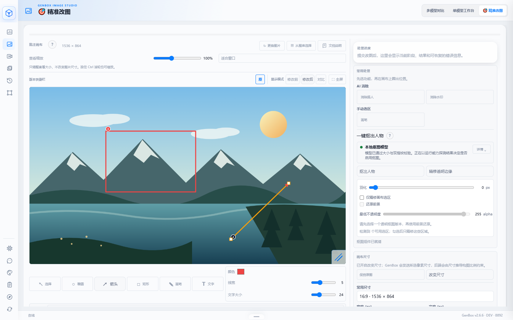
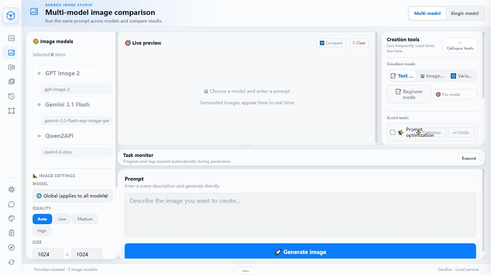
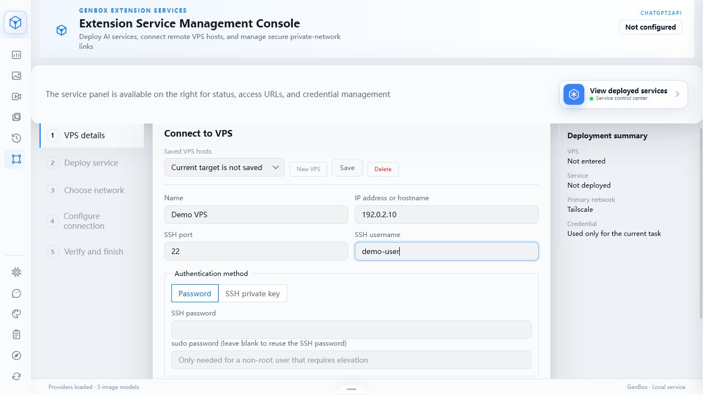
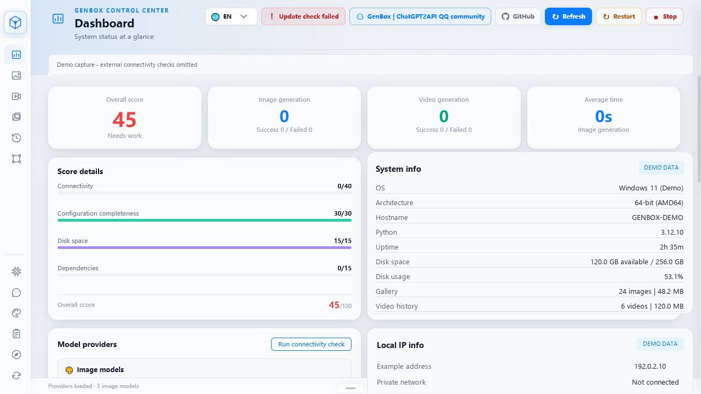
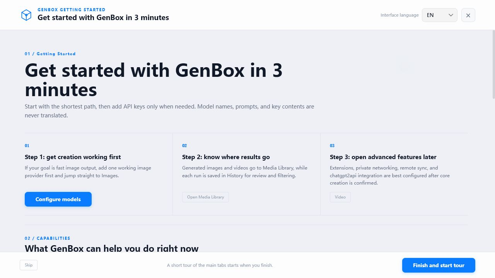
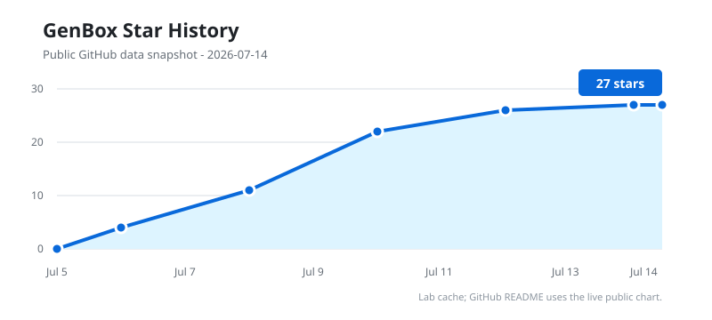

# GenBox - Multi-Model AI Creation and Media Workspace

[](https://github.com/liwei9745/GenBox/actions/workflows/build.yml)
[](https://github.com/liwei9745/GenBox/releases/latest)
[](https://github.com/liwei9745/GenBox/stargazers)
[](https://github.com/liwei9745/GenBox/pkgs/container/genbox)
[](LICENSE)
[](https://deepwiki.com/liwei9745/GenBox)

**Send one idea to several models, compare the results side by side, then refine them with annotations, expansion, cutout, and version comparison while keeping everything in your own media workspace.**

[中文](README.md) · [Download](https://github.com/liwei9745/GenBox/releases/latest) · [3-minute start](#quick-start) · [Documentation map](docs/DOCUMENTATION-MAP.md) · [Report an issue](https://github.com/liwei9745/GenBox/issues)

## Why GenBox Exists

GenBox started with a practical question: **what changes when the same prompt is sent to different image models?** Most tools focus on one model or one generation at a time, which makes comparison a repetitive cycle of switching pages, copying settings, and organizing files by hand.

The project began as a multi-model image comparison workspace and grew with real usage: precision editing, video creation, prompt assistance, a local media library, history, themes, bilingual UI, and an Extension Center for self-hosted services. The goal is to keep choice and control for AI media enthusiasts and model tinkerers while giving first-time API users a path they can actually follow.

GenBox is built for visual AI enthusiasts, model evaluators, self-hosting hobbyists, and anyone who wants one interface for OpenAI-compatible services, Gemini, Qwen, Agnes, and other configurable model endpoints.

> [!IMPORTANT]
> **v2.6.8: Precision Edit major update.** The configured GPT target model has passed user acceptance, with model-first size presets, visual annotation editing, local person cutout, version metadata and first-use navigation. [Read the release notes](release-notes-v2.6.8.md)

> [!NOTE]
> Remote precision edits use your configured provider. GPT acceptance was completed by the user; release automation makes no paid generation requests. Other vendors still await manual acceptance. Packages include NumPy, ONNX Runtime, and the local cutout adapter, but **not the ONNX cutout checkpoint**. Production network download and installation remain disabled because provenance, training-data history, and commercial-use rights are **UNVERIFIED**. Operator-provided models must pass integrity and execution checks.

## Main Interface Screenshots

| Precision Edit V4: annotations, expansion, and versions | Multi-model image generation and comparison |
|---|---|
|  |  |
| **Extension Center and remote services** | **Dashboard and runtime status** |
|  |  |

<details>
<summary><strong>View the three-minute onboarding screen</strong></summary>



</details>

> Screenshots come from an isolated empty client. Hostnames, IP addresses, capacity, and runtime values are explicitly labeled demo data and do not identify a real device.

## Core Highlights

- **Precision Edit V4**: open a local file, media-library item, or generated result; mark intent with Select/Move, arrow, rectangle, ellipse, brush, eraser, and text tools; undo or redo safely, move and resize objects, and choose a result version as the base for the next edit.
- **Size expansion and version comparison**: run resize-only expansion for sizes explicitly supported by the Provider. Exact returned pixels are checked by default, with an explicit bounded `fit_crop` option. Browse results as versions and switch between Before, After, or a draggable comparison slider; transparent areas use a checkerboard.
- **Local cutout framework**: transparent cutout, selection-aware refinement, feathering, and foreground restore are integrated. The runtime adapter is packaged, while the ONNX checkpoint remains operator-provided and must pass integrity and executable checks.
- **Provider capability gates**: precision-edit support and sizes must be endpoint-declared or user-confirmed. Alias relationships come only from explicit configuration or a limited user-confirmed compatibility mapping; merely discovering a similar model name never authorizes it. Provider images also pass MIME, compressed-byte, decoded-pixel, and decompression-bomb checks.
- **Side-by-side model comparison**: run one prompt across several models and compare composition, style, and detail, or switch to a focused single-model workspace.
- **Image and video creation**: text-to-image, image-to-image, variations, upscaling, text-to-video, image-to-video, and keyframe flows.
- **Local media library**: keep images, videos, prompts, model information, and generation history together for filtering and reuse.
- **Prompt assistance**: turn everyday language into a model-ready prompt without hiding controls from advanced users.
- **Extension Center**: manage VPS targets, isolated service instances, private networking, and remote image imports through guided UI steps.
- **Complete release matrix**: download Windows, macOS, or Linux clients, or use the Docker Compose bundle, GHCR image, or source package. Desktop clients include their Python runtime.
- **Local-first and self-hostable**: run GenBox as a desktop client or keep it on a NAS, VPS, or Docker host.

## Precision Edit: Major Update

**Choose a model and a size, then point with an arrow or mark a region with a rectangle or circle.**

- **Intelligent expansion**: 27 presets across 1K, 2K and 4K tiers, with editable composition guidance. Capability and authorization state follow the selected endpoint and model.
- **Visual annotation editing**: arrows, rectangles, ellipses and brush marks make the intended edit location clear. Move, resize, undo and redo annotations; actual editing accuracy depends on the model.
- **One-click local person cutout**: use a configured and validated local model to separate a person from the background, refine edges, feather and recover foreground without sending the image to an online generator. Online AI removal is a separate operation.
- **Continue and compare**: restore workflows, compare edit versions, and view actual dimensions and available version timestamps. First-use navigation can be reopened from Guide.

**USER-CONFIRMED (September 10, 2026):** The configured GPT target identifier `gpt-image-2.5-c` passed user acceptance. The table below describes GenBox presets, not an official support list for every GPT endpoint or vendor.

| Aspect | 1K tier | 2K tier | 4K tier |
|---|---|---|---|
| 1:1 | 1024 × 1024 | 2048 × 2048 | 2880 × 2880 |
| 16:9 | 1168 × 656 | 2048 × 1152 | 3840 × 2160 |
| 9:16 | 656 × 1168 | 1152 × 2048 | 2160 × 3840 |
| 4:3 | 1024 × 768 | 2048 × 1536 | 3328 × 2480 |
| 3:4 | 768 × 1024 | 1536 × 2048 | 2480 × 3328 |
| 3:2 | 1008 × 672 | 2016 × 1344 | 3520 × 2352 |
| 2:3 | 672 × 1008 | 1344 × 2016 | 2352 × 3520 |
| 21:9 | 1344 × 576 | 2544 × 1088 | 3840 × 1648 |
| 9:21 | 576 × 1344 | 1088 × 2544 | 1648 × 3840 |

> Tiers are preset categories, not fixed edge lengths; some ratios are pixel-aligned approximations. Model size checks actual output strictly. Undeclared sizes need a trial authorization for the exact endpoint, model and dimensions. Crop to fit applies local cropping/scaling after one online edit. Authorization never generates automatically; failed edits are not automatically retried and 503 does not mean a size is unsupported. Gemini, Qwen and other vendors await separate manual acceptance.

## Quick Start

### Which file should I download?

| Your system | Download | Run it |
|---|---|---|
| Windows 10/11 | [GenBox-Windows.zip](https://github.com/liwei9745/GenBox/releases/latest/download/GenBox-Windows.zip) | Extract and double-click `GenBox.exe` |
| macOS | [GenBox-macOS.zip](https://github.com/liwei9745/GenBox/releases/latest/download/GenBox-macOS.zip) | Extract and run `GenBox-macOS` |
| Linux | [GenBox-Linux-x64.zip](https://github.com/liwei9745/GenBox/releases/latest/download/GenBox-Linux-x64.zip) | Extract, add execute permission, and run |
| NAS / VPS / Docker | [Open the latest release](https://github.com/liwei9745/GenBox/releases/latest) | Download the archive containing `Docker-Compose` |

Desktop packages include their runtime. **You do not need to install Python.**

### Get running in three minutes

1. Download and extract the package for your platform.
2. Start GenBox. If the browser does not open, visit **[http://localhost:8891](http://localhost:8891)**.
3. Open Model settings and add one image service URL, model name, and API key.
4. Open Images, select a model, enter a prompt, and run your first generation.

> A Provider is simply a model-service connection. GenBox supplies the shared interface, parameters, comparison, and media management; the configured service performs the generation. Precision Edit additionally requires the endpoint to declare, or you to confirm, the model's edit capability and supported sizes. A custom alias inherits a verified contract only after you explicitly confirm its compatibility mapping.

### Before your first run

- GenBox does not include commercial model credits. You need access to the model service you configure.
- Keep API keys inside your own GenBox. Never post them in issues, screenshots, chat logs, or public diagnostics.
- Release clients use `http://localhost:8891`; source development uses `8892` by default.
- The ONNX cutout checkpoint is not included with v2.6.8, and production network installation is disabled. Without a validated local model, cutout remains safely unavailable.
- Windows clients from v2.4.1 or earlier need one manual ZIP upgrade to v2.5.1. See the [upgrade notes](release-notes-v2.5.1.md#upgrade-safely).
- chatgpt2api is a third-party reverse-engineering research project. Do not test it with important accounts.

<details>
<summary><strong>Docker, NAS, or VPS deployment</strong></summary>

Download the latest release archive containing `Docker-Compose`, extract it, and run:

```bash
cp .env.example .env
docker compose pull
docker compose up -d
```

Open `http://localhost:8891`. Runtime data lives in `storage/`; back it up before upgrades. Remote access requires administrator authentication and an explicit HTTPS or private-network `ALLOWED_ORIGINS` value.

</details>

<details>
<summary><strong>Run from source</strong></summary>

```bash
git clone https://github.com/liwei9745/GenBox.git
cd GenBox
python -m venv .venv

# Windows
.venv\Scripts\python -m pip install -r requirements.txt
.venv\Scripts\python main.py

# macOS / Linux
.venv/bin/python -m pip install -r requirements.txt
.venv/bin/python main.py
```

Source development opens at `http://localhost:8892` by default. See the [documentation map](docs/DOCUMENTATION-MAP.md) for environment variables and development workflows.

</details>

## GenBox and chatgpt2api

Think of chatgpt2api as a remote creation station and GenBox as your creation console and media home. chatgpt2api supplies compatible APIs, account operations, and remote images; GenBox handles multi-model creation, media organization, history, deployment, and connection management.

GenBox can guide an isolated deployment, prepare a Tailscale private route, Pull remote images, and receive authenticated, idempotent image Push requests. With a compatible chatgpt2api sender build, single-image, manual batch, and scheduled incremental transfers are supported. This does not mean every release of the original upstream repository already contains the sender changes.

<details>
<summary><strong>Upstream and source-cleanup boundaries</strong></summary>

Sender changes remain in an independent branch and upstream proposal process. Before using an unconfirmed stock chatgpt2api release, verify that it implements GenBox Push v1. Source deletion is off by default and disabled in development. It is permitted only when the user explicitly selects deletion for that action, the sender receives an authenticated `safe_to_delete_source=true` receipt with a matching SHA-256, and the source bytes are rechecked as unchanged. Upstream merge or real-environment behavior cannot be inferred from the successful GenBox v2.6.7 release.

</details>

## More Documentation

The README stays focused on the first successful run. Use the [documentation map](docs/DOCUMENTATION-MAP.md) to find advanced usage, operations, security, integration, and development material:

| I want to learn about | Start here |
|---|---|
| Installation, upgrades, and known issues | [v2.6.8 release notes](release-notes-v2.6.8.md) · [Changelog](CHANGELOG.md) |
| Product direction and current boundaries | [Product definition](docs/PRODUCT.md) · [Current status](docs/STATUS.md) |
| NAS, VPS, Docker, and safe releases | [Development and release lifecycle](docs/DEVELOPMENT-LIFECYCLE.md) |
| How GenBox connects to chatgpt2api | [Integration contract](docs/INTEGRATION.md) |
| Architecture, decisions, and future phases | [Architecture](docs/ARCHITECTURE.md) · [Decisions](docs/DECISIONS.md) · [Roadmap](docs/ROADMAP.md) |

## Acknowledgements

GenBox builds on ideas and public work from the following projects and services:

| Project / service | Author / team | Relationship to GenBox |
|---|---|---|
| [yukkcat/chatgpt2api](https://github.com/yukkcat/chatgpt2api) | [yukkcat](https://github.com/yukkcat) | Current Extension Center deployment and integration reference |
| [basketikun/chatgpt2api](https://github.com/basketikun/chatgpt2api) | [basketikun](https://github.com/basketikun) | One foundation of earlier GPT Image and chatgpt2api support |
| [4k-image-api](https://github.com/jianjianai/4k-image-api) | [jianjianai](https://github.com/jianjianai) | Image transformation and Lanczos upscaling reference |
| [flow2api](https://github.com/TheSmallHanCat/flow2api) | [TheSmallHanCat](https://github.com/TheSmallHanCat) | Gemini image and video integration reference |
| [gemini2api](https://github.com/xwteam/gemini2api) | [xwteam](https://github.com/xwteam) | Gemini-compatible API reference |
| [AIClient2API](https://github.com/justlovemaki/AIClient2API) | [justlovemaki](https://github.com/justlovemaki) | Multi-protocol AI gateway reference |
| [Agnes AI](https://platform.agnes-ai.com) | [Sapiens AI](https://agnes-ai.com) | Agnes image and video APIs |

Special thanks to [@yukkcat](https://github.com/yukkcat) for proposing the GHCR Docker Compose release bundle in [PR #4](https://github.com/liwei9745/GenBox/pull/4).

### Upstream Project Contributors

Thank you to everyone who contributes to the upstream projects whose public work helped shape GenBox.

<a href="https://github.com/basketikun/chatgpt2api/graphs/contributors">
  
</a>

## Star History

[](https://www.star-history.com/#liwei9745/GenBox&Date)

## Community and License

- Maintainer: [@liwei9745](https://github.com/liwei9745)
- Bugs and ideas: [GitHub Issues](https://github.com/liwei9745/GenBox/issues)
- Community: [GenBox / ChatGPT2API QQ group](https://qm.qq.com/q/yegwCqJisS)
- License: [GNU GPL v3.0 only](LICENSE). Executables, Docker bundles, and
  source are available from the GenBox repository; redistributing a modified
  GenBox requires providing the corresponding source under GPLv3.
