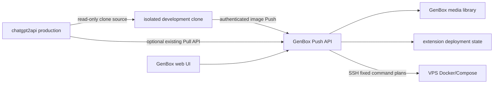
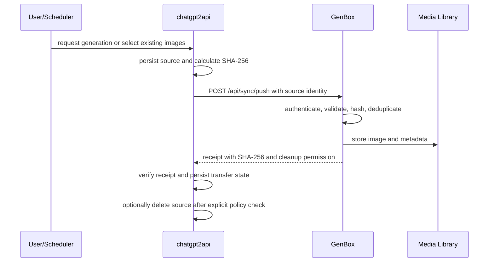

# GenBox Extension And Image Transfer Architecture

## System Context

GenBox is a single-process FastAPI application that serves a static browser UI
and stores configuration and media on the filesystem. Current background task
state is process-local memory and is not durable across a restart. The extension
initiative connects GenBox to independently deployed services. The first
integration target is `yukkcat/chatgpt2api`.

## Repository Boundaries

### GenBox Repository

GenBox owns:

- The extension catalog and guided deployment UI.
- VPS target metadata, SSH host-key confirmation, environment discovery, fixed
  deployment plans, and GenBox-managed instance records.
- Network-adapter orchestration and connectivity verification.
- The image Push receiving API and existing remote Pull workflow.
- Image validation, hashing, deduplication, import, tags, and receipts.
- Display and one-click copy of non-sensitive service access information.
- One-time delivery of newly generated service credentials.

### chatgpt2api Repository

chatgpt2api must own:

- Per-generation "Push to GenBox" selection.
- Destination configuration and secure Push-key storage.
- A shared Push service used by single, batch, and scheduled workflows.
- Gallery selection, date-range batches, progress, retry, and cancellation.
- Durable transfer receipts, cursor, scheduler state, and worker lease.
- Optional source cleanup after a verified GenBox receipt.

GenBox receiver completion does not imply chatgpt2api sender completion.

## Current GenBox Structure

- `main.py`: FastAPI application, routes, authentication, and task orchestration.
- `static/`: bundled SPA. Extension behavior is in `static/js/extensions.js`.
- `extensions/`: catalog, models, storage, discovery, network adapters, local
  Tailscale support, and remote deployment orchestration.
- `sync/`: remote client, manifests, hashing, and incoming image validation.
- `storage/`: runtime files. Secrets and user data in this directory must not be
  committed.
- `tests/`: unit and route-level behavior tests.

## Extension Deployment Architecture

The browser sends structured target, credential, and deployment choices to
GenBox. It never sends arbitrary shell. GenBox builds a fixed command plan,
performs read-only discovery, checks conflicts and capacity, binds execution to
a short-lived plan, and runs approved commands over SSH.

Managed instances require:

- A unique instance ID.
- A unique host directory and Compose project.
- A unique host port.
- Ownership labels and a non-sensitive local registration record.
- A generated management key delivered once after deployment.
- Health verification before successful delivery.

Only the standard Docker Compose path is currently eligible for automated
execution. WARP and Python modes remain discovery or planning concerns until
their isolation, ownership, rollback, and verification contracts are complete.

## Environment Isolation

An existing VPS chatgpt2api instance is treated as production. Feature work
uses a development clone with separate directories, volumes, ports, names,
Compose project, credentials, and Push identity. Production source data is
read-only. Clone creation must remove inherited Push destinations, receipts,
schedules, leases, and management keys that could target production systems.

See `docs/DEVELOPMENT-LIFECYCLE.md` for mandatory environment gates.

## Network Architecture

The business protocol uses a final GenBox URL and is not tied to a network
vendor. Adapters may establish one primary connection using:

- Tailscale for a private Tailnet path.
- NetBird for a private managed or self-hosted network.
- Cloudflare Tunnel for an outbound HTTPS tunnel.

The target acceptance contract requires endpoint reachability and an
application-level GenBox Push probe. Current code verifies a GenBox root URL for
the Tailscale path and does not yet apply an equivalent Push probe to every
adapter. Process presence or the current partial checks are not sufficient
evidence for completing the network phase.

Runtime IP addresses are external state. They belong in `docs/STATUS.md` only
when accompanied by a verification date and method.

## Image Push Flow

The protocol and current GenBox endpoint are detailed in
`docs/chatgpt2api-push-integration.md` and `docs/INTEGRATION.md`.

## Pull Compatibility

GenBox retains its existing server-side Pull workflow for environments where
the remote service cannot reach GenBox. Push and Pull share content-based
deduplication but have different credentials and initiators. Neither direction
is a two-way synchronization system with conflict resolution.

## Identity, Authentication, And Secrets

- GenBox administrator authentication is separate from Push source identity.
- Each sender uses a stable source ID and independently revocable Push key.
- SSH credentials and network enrollment tokens are session secrets, not
  ordinary target metadata.
- New service management credentials are written to the remote instance and
  delivered once by default. With explicit per-instance opt-in, managed-service
  credentials may also be stored in the local encrypted vault under `storage/`;
  its password and derived key remain process-memory-only.
- Secret values must not appear in task logs, status payloads, browser storage,
  URLs, screenshots, examples, or Git.

## Idempotency And Metadata

Push idempotency uses source identity, stable remote path, and content SHA-256.
GenBox also uses content hashes to avoid duplicate local files. Imported media
should preserve available creation time, prompt, model, source service, source
instance, and transfer method. Missing metadata must not block valid image
content from importing.

## Scheduling And Retry

Scheduling belongs to chatgpt2api. A durable scheduler stores per-image state
and a scan cursor, not only a single last-run timestamp. Retries use bounded
exponential backoff and preserve source files. A worker lease prevents duplicate
schedulers from processing the same plan concurrently.

## Failure And Recovery

- Discovery and planning do not mutate a remote service.
- A failed development deployment must not modify the production source.
- Failed Push keeps the source image and records a retryable error.
- A missing or mismatched receipt never authorizes deletion.
- Deployment must retain enough ownership and backup evidence for targeted
  rollback.
- Browser refresh must eventually be able to recover durable task state rather
  than relying only on process memory.

## Zero-Code Deployment Control Flow

`Browser UI -> versioned deployment adapter -> SSH orchestrator -> VPS`

The UI sends validated intent, not shell source. The adapter owns fixed commands,
parameter validation, secret redaction, timeouts, success checks, and recovery
messages. The SSH orchestrator verifies the host key and executes the plan.
